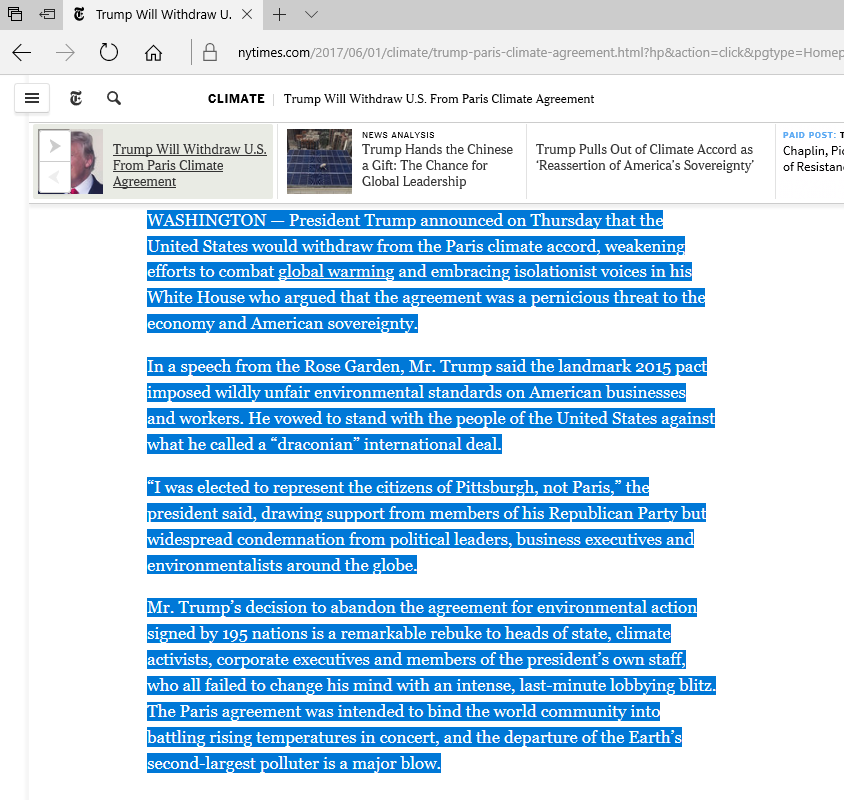
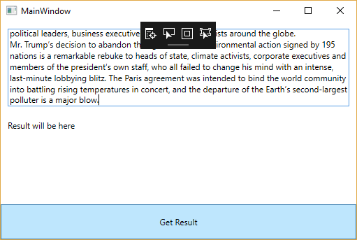
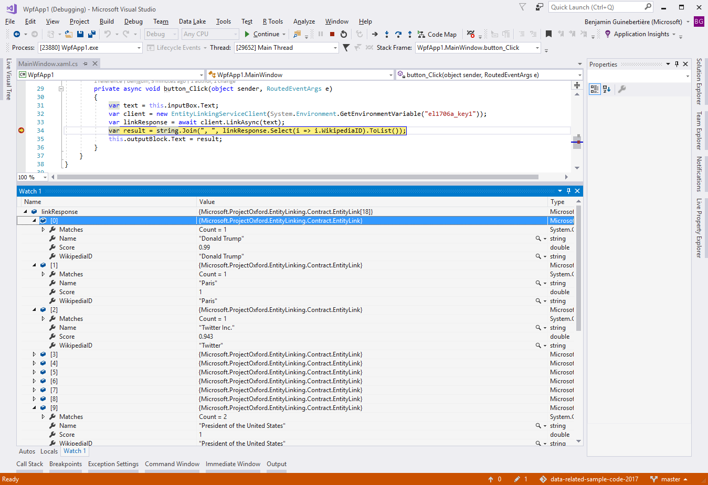
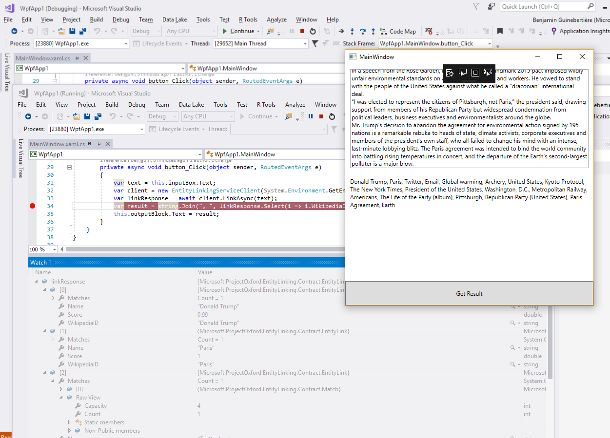
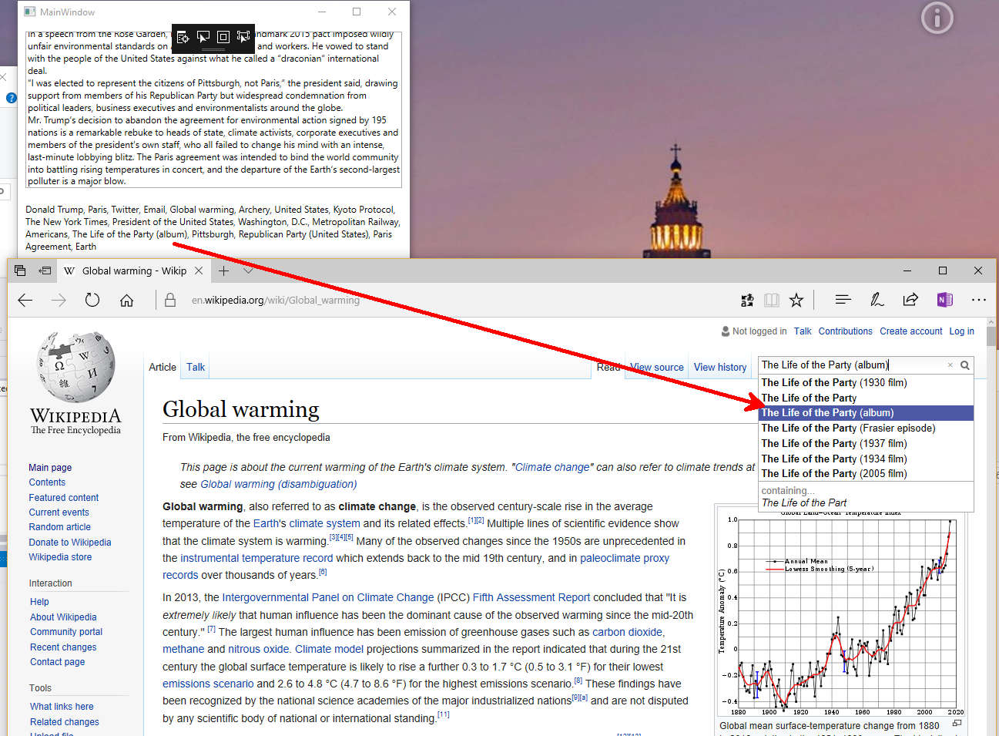

# Entity Linking

## Credits
- <https://docs.microsoft.com/en-us/azure/cognitive-services/entitylinking/gettingstarted>

## create a key

A key can be created by going to <https://azure.microsoft.com/en-us/try/cognitive-services/?api=entity-linking-intelligence-service>

NB as the key is passed as an environment variable, a WPF application was created instead of a Windows universal App.

## Sample execution: 

