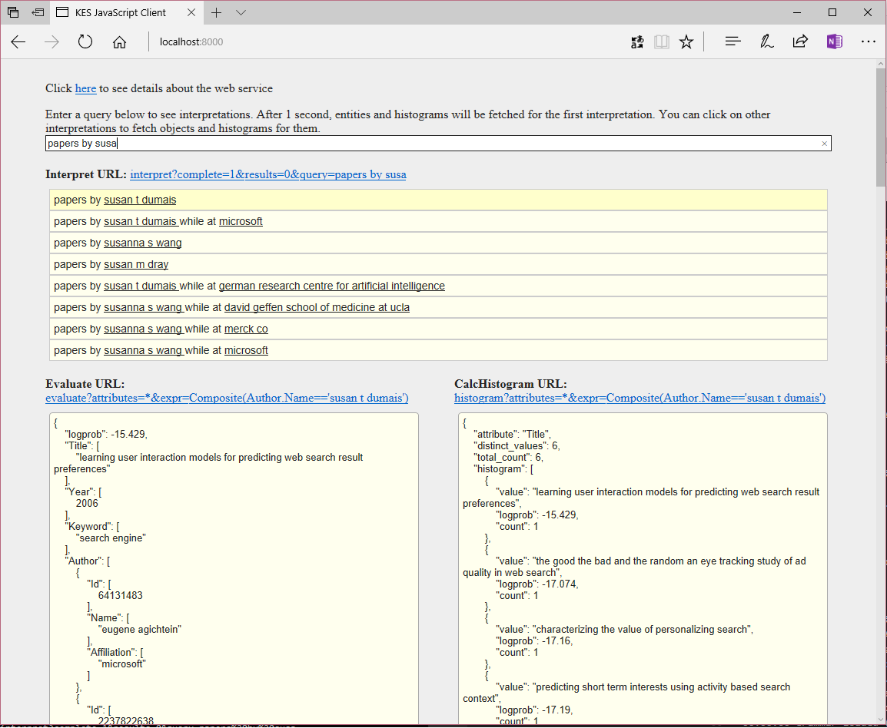

# trying KES

## Credits

This is just execution from the sample in documentation. 

cf <https://docs.microsoft.com/en-us/azure/cognitive-services/kes/overview>

## example

```cmd
cd /c c:\afac\Example
set kes_exe="C:\Program Files\Microsoft\Knowledge Exploration Service\kes.exe" 
%kes_exe% build_index Academic.schema Academic.data Academic.index
```

sample result:
```
00:00:00 Input Schema: Academic.schema
00:00:00 Input Data: Academic.data
00:00:00 Output Index: Academic.index
00:00:00 Loading synonym file: Keyword.syn
00:00:00 Loaded 3700 synonyms (4.5 ms)
00:00:00 Pass 1 started
00:00:00 Total number of entities: 1000
00:00:00 Sorting entities
00:00:00 Pass 1 finished (14.7 ms)
00:00:00 Pass 2 started
00:00:00 Pass 2 finished (20.1 ms)
00:00:00 Processed attribute Title (26.2 ms)
00:00:00 Processed attribute Year (0.0 ms)
00:00:00 Processed attribute Author.Id (0.8 ms)
00:00:00 Processed attribute Author.Name (16.9 ms)
00:00:00 Processed attribute Author.Affiliation (3.2 ms)
00:00:00 Processed attribute Keyword (31.5 ms)
00:00:00 Pass 3 started
00:00:00 Pass 3 finished (23.9 ms, 73 page faults)
00:00:00 Post-processing started
00:00:00 Optimized attribute Title (0.3 ms)
00:00:00 Optimized attribute Year (0.0 ms)
00:00:00 Optimized attribute Author.Id (0.0 ms)
00:00:00 Optimized attribute Author.Name (0.7 ms)
00:00:00 Optimized attribute Author.Affiliation (0.3 ms)
00:00:00 Optimized attribute Keyword (0.9 ms)
00:00:00 Global optimization
00:00:00 Post-processing finished (25.5 ms)
00:00:00 Finalizing index
00:00:00 Total time: 193.5 ms
00:00:00 Peak memory usage: 24 MB (commit) + 0 MB (data file) = 24 MB
```

```cmd
%kes_exe% build_grammar Academic.xml Academic.grammar
```

```
C:\afac\Example>%kes_exe% build_grammar Academic.xml Academic.grammar
Input XML: Academic.xml
Output Grammar: Academic.grammar
```

```cmd
%kes_exe% host_service Academic.grammar Academic.index --port 8000
```

```
C:\afac\Example>%kes_exe% host_service Academic.grammar Academic.index --port 8000
00:00:00 Input Grammar: Academic.grammar
00:00:00 Input Index: Academic.index
00:00:00 Web Service URL: http://localhost:8000/
00:00:00 Index loaded (0.3 ms)
00:00:00 Prefetching index file; this can take a while
00:00:00 Index prefetched (0.2 ms)
00:00:00 Grammar loaded (0.2 ms)
00:00:00 Web Server is running. Type 'quit' to stop.
00:01:10 [1] /interpret?complete=1&results=0&query=p
00:01:10 [1] 9 interpretations returned (34.38ms)
00:01:10 [2] /interpret?complete=1&results=0&query=pa
00:01:10 [2] 9 interpretations returned (7.03ms)
00:01:10 [3] /interpret?complete=1&results=0&query=pap
00:01:10 [3] 9 interpretations returned (17.05ms)
00:01:11 [4] /evaluate?attributes=*&expr=Keyword%3D%3D'vocal%20tract'
00:01:11 [4] 1 entities returned (6.20ms)
00:01:12 [5] /histogram?attributes=*&expr=Keyword%3D%3D'vocal%20tract'
00:01:12 [5] 1 matching entities (10.57ms)
00:01:12 [6] /interpret?complete=1&results=0&query=pape
00:01:12 [6] 9 interpretations returned (26.07ms)
00:01:13 [7] /evaluate?attributes=*&expr=Keyword%3D%3D'vocal%20tract'
00:01:13 [7] 1 entities returned (0.98ms)
00:01:13 [8] /histogram?attributes=*&expr=Keyword%3D%3D'vocal%20tract'
00:01:13 [8] 1 matching entities (1.49ms)
00:01:24 [9] /interpret?complete=1&results=0&query=paper
00:01:24 [9] 9 interpretations returned (13.28ms)
00:01:24 [10] /interpret?complete=1&results=0&query=papers
00:01:24 [10] 9 interpretations returned (22.66ms)
00:01:25 [11] /evaluate?attributes=*&expr=Keyword%3D%3D'vocal%20tract'
00:01:25 [11] 1 entities returned (0.83ms)
00:01:25 [12] /histogram?attributes=*&expr=Keyword%3D%3D'vocal%20tract'
00:01:25 [12] 1 matching entities (1.61ms)
00:01:25 [13] /interpret?complete=1&results=0&query=papers%20
00:01:25 [13] 9 interpretations returned (26.23ms)
00:01:27 [14] /evaluate?attributes=*&expr=Keyword%3D%3D'vocal%20tract'
00:01:27 [14] 1 entities returned (0.37ms)
00:01:27 [15] /histogram?attributes=*&expr=Keyword%3D%3D'vocal%20tract'
00:01:27 [15] 1 matching entities (0.60ms)
00:01:28 [16] /interpret?complete=1&results=0&query=papers%20b
00:01:28 [16] 9 interpretations returned (17.60ms)
00:01:28 [17] /interpret?complete=1&results=0&query=papers%20by%20
00:01:28 [17] 9 interpretations returned (9.50ms)
00:01:28 [18] /interpret?complete=1&results=0&query=papers%20by%20
00:01:28 [18] 9 interpretations returned (4.58ms)
00:01:29 [19] /interpret?complete=1&results=0&query=papers%20by%20s
00:01:29 [19] 9 interpretations returned (12.15ms)
00:01:29 [20] /interpret?complete=1&results=0&query=papers%20by%20su
00:01:29 [20] 9 interpretations returned (4.25ms)
00:01:29 [21] /interpret?complete=1&results=0&query=papers%20by%20sus
00:01:29 [21] 8 interpretations returned (1.97ms)
00:01:30 [22] /evaluate?attributes=*&expr=Composite(Author.Name%3D%3D'susan%20t%20dumais')
00:01:30 [22] 6 entities returned (1.27ms)
00:01:30 [23] /histogram?attributes=*&expr=Composite(Author.Name%3D%3D'susan%20t%20dumais')
00:01:30 [23] 6 matching entities (1.61ms)
00:04:39 [24] /interpret?complete=1&results=0&query=papers%20by%20susa
00:04:39 [24] 8 interpretations returned (2.61ms)
00:04:40 [25] /evaluate?attributes=*&expr=Composite(Author.Name%3D%3D'susan%20t%20dumais')
00:04:40 [25] 6 entities returned (1.32ms)
00:04:40 [26] /histogram?attributes=*&expr=Composite(Author.Name%3D%3D'susan%20t%20dumais')
00:04:40 [26] 6 matching entities (3.28ms)
00:04:43 [27] /interpret?complete=1&results=0&query=papers%20by%20susa
00:04:43 [27] 8 interpretations returned (3.08ms)
00:04:43 [28] /interpret?complete=1&results=0&query=papers%20by%20susa
00:04:43 [28] 8 interpretations returned (5.32ms)
00:04:44 [29] /evaluate?attributes=*&expr=Composite(Author.Name%3D%3D'susan%20t%20dumais')
00:04:44 [29] 6 entities returned (1.47ms)
00:04:44 [30] /histogram?attributes=*&expr=Composite(Author.Name%3D%3D'susan%20t%20dumais')
00:04:44 [30] 6 matching entities (1.06ms)
00:04:48 [31] /interpret?complete=1&results=0&query=papers%20by%20susa
00:04:48 [31] 8 interpretations returned (1.22ms)
00:04:48 [32] /interpret?complete=1&results=0&query=papers%20by%20susa
00:04:48 [32] 8 interpretations returned (1.37ms)
00:04:49 [33] /evaluate?attributes=*&expr=Composite(Author.Name%3D%3D'susan%20t%20dumais')
00:04:49 [33] 6 entities returned (0.83ms)
00:04:49 [34] /histogram?attributes=*&expr=Composite(Author.Name%3D%3D'susan%20t%20dumais')
00:04:49 [34] 6 matching entities (2.08ms)
quit
00:07:07 stopping
```



Web API sample
```
http://localhost:8000/interpret?query=papers%20by%20sus&complete=1&count=5
```

```json
{
  "query": "papers by sus",
  "interpretations": [
    {
      "logprob": -15.895,
      "parse": "<rule name=\"#GetPapers\">papers by <attr name=\"academic#Author.Name\">susan t dumais</attr></rule>",
      "rules": [
        {
          "name": "#GetPapers",
          "output": {
            "type": "query",
            "value": "Composite(Author.Name=='susan t dumais')"
          }
        }
      ]
    },
    {
      "logprob": -17.395,
      "parse": "<rule name=\"#GetPapers\">papers by <attr name=\"academic#Author.Name\">susan t dumais</attr> while at <attr name=\"academic#Author.Affiliation\">microsoft</attr></rule>",
      "rules": [
        {
          "name": "#GetPapers",
          "output": {
            "type": "query",
            "value": "Composite(And(Author.Name=='susan t dumais',Author.Affiliation=='microsoft'))"
          }
        }
      ]
    },
    {
      "logprob": -18.339,
      "parse": "<rule name=\"#GetPapers\">papers by <attr name=\"academic#Author.Name\">susanna s wang</attr></rule>",
      "rules": [
        {
          "name": "#GetPapers",
          "output": {
            "type": "query",
            "value": "Composite(Author.Name=='susanna s wang')"
          }
        }
      ]
    },
    {
      "logprob": -19.144,
      "parse": "<rule name=\"#GetPapers\">papers by <attr name=\"academic#Author.Name\">susan m dray</attr></rule>",
      "rules": [
        {
          "name": "#GetPapers",
          "output": {
            "type": "query",
            "value": "Composite(Author.Name=='susan m dray')"
          }
        }
      ]
    },
    {
      "logprob": -19.574,
      "parse": "<rule name=\"#GetPapers\">papers by <attr name=\"academic#Author.Name\">susan t dumais</attr> while at <attr name=\"academic#Author.Affiliation\">german research centre for artificial intelligence</attr></rule>",
      "rules": [
        {
          "name": "#GetPapers",
          "output": {
            "type": "query",
            "value": "Composite(And(Author.Name=='susan t dumais',Author.Affiliation=='german research centre for artificial intelligence'))"
          }
        }
      ]
    }
  ]
}
```

