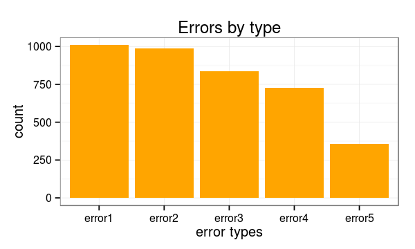
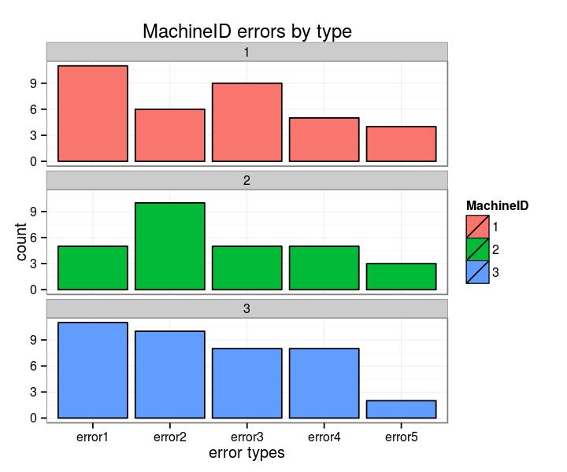
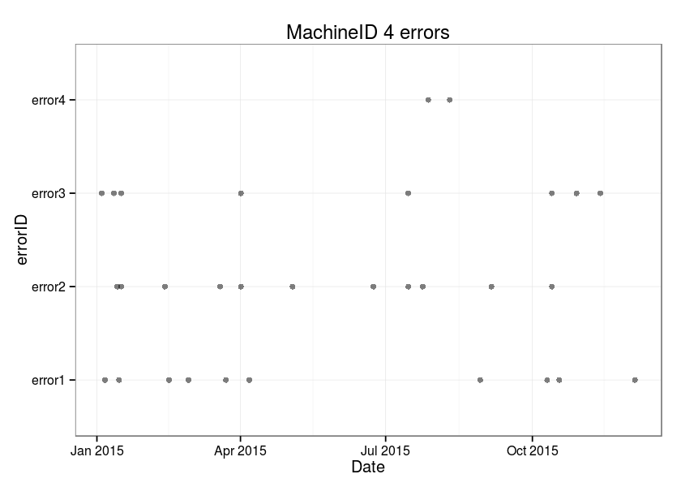
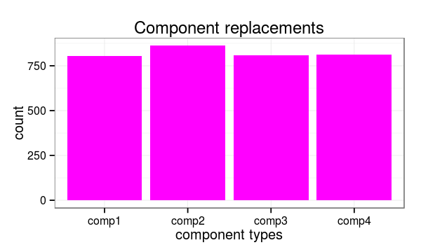
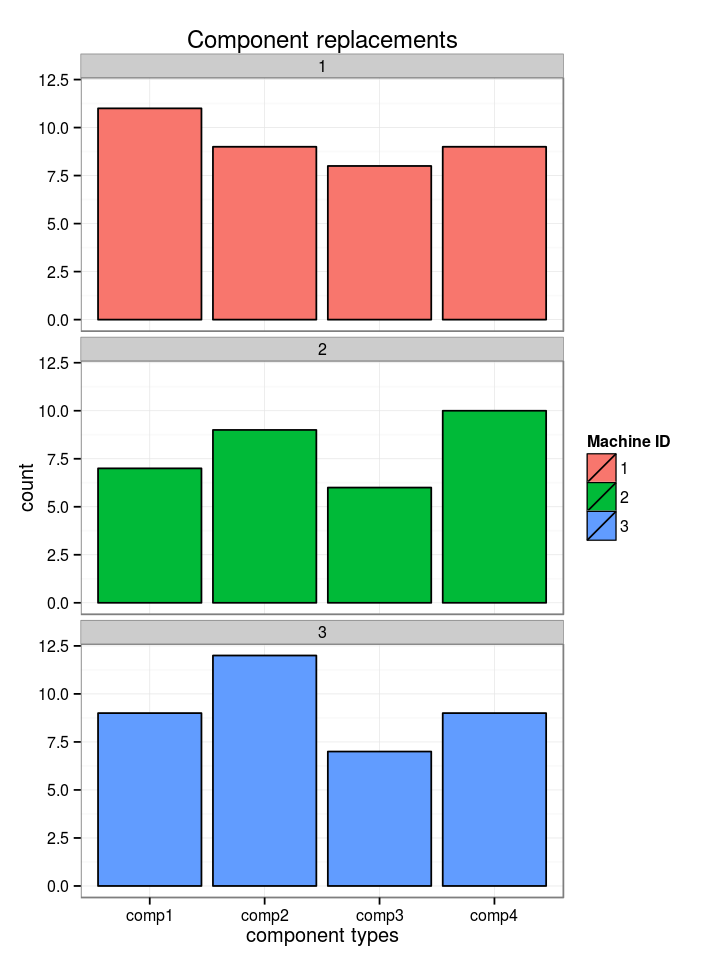
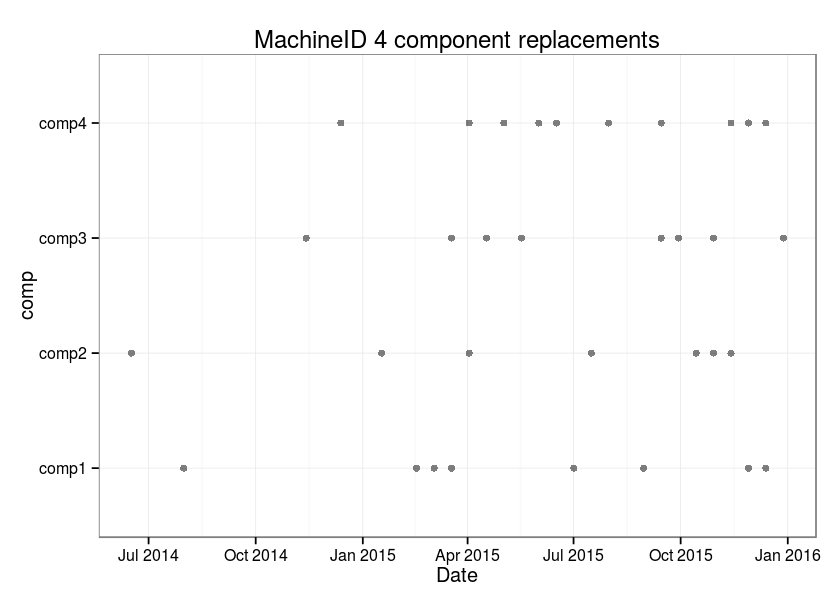
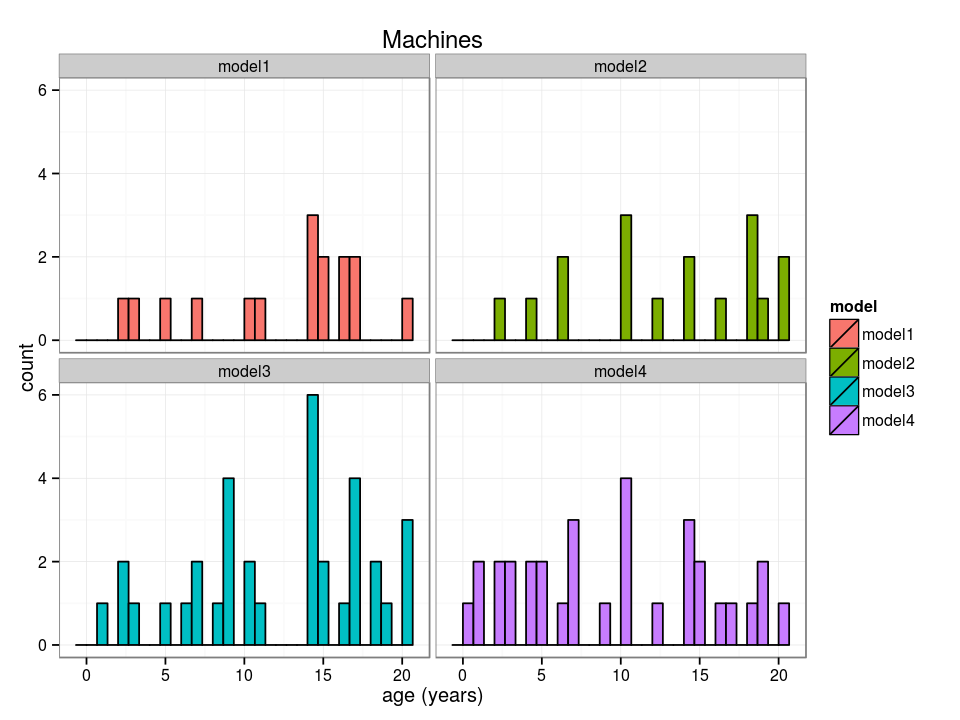
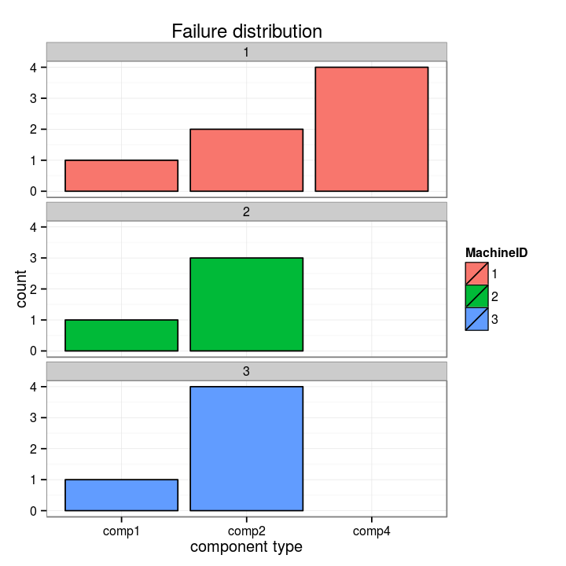
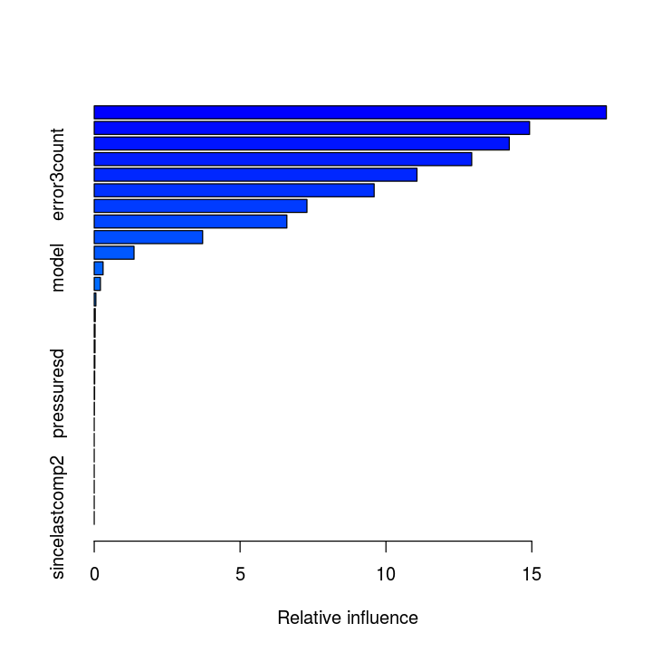
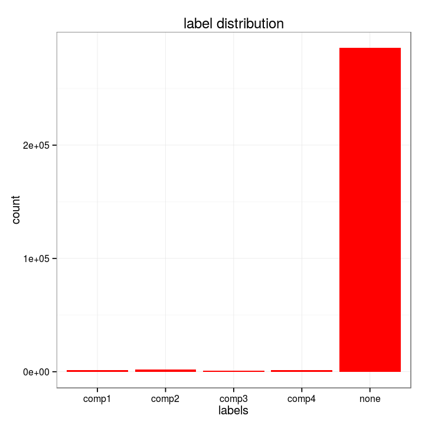

# Modelling Guide for Predictive Maintenance

[Problem Description](#Problem-Description) 

[Data Sources](#Data-Sources)

 - [Telemetry](#Telemetry)
 - [Errors](#Errors)
 - [Maintenance](#Maintenance)
 - [Machines](#Machines)
 - [Failures](#Failures)
    
[Feature Engineering](#Feature-Engineering)

- [Lag Features from Telemetry](#Lag-Features-from-Telemetry)
- [Lag Features from Errors](#Lag-Features-from-Errors)
- [Days Since Last Replacement from Maintenance](#Days-Since-Last-Replacement-from-Maintenance)
- [Machine Features](#Machine-Features)

[Label Construction](#Label-Construction)

[Modelling](#Modelling)

- [Training, Validation and Testing](#Training,-Validation-and-Testing)
- [Evaluation](#Evaluation)

[Summary](#Summary)


## Problem Description
A major problem faced by businesses in asset-heavy industries such as manufacturing is the significant costs that are associated with delays in the production process due to mechanical problems. Most of these businesses are interested in predicting these problems in advance so that they can proactively prevent the problems before they occur which will reduce the costly impact caused by downtime. Please refer to the [playbook for predictive maintenance](https://azure.microsoft.com/en-us/documentation/articles/cortana-analytics-playbook-predictive-maintenance/ ) for a detailed explanation of common use cases in predictive maintenance and modelling approaches.

In this notebook, we follow the ideas from the playbook referenced above and aim to provide the steps of implementing a predictive model for a scenario which is based on a synthesis of multiple real-world business problems. This example brings together common data elements observed among many predictive maintenance use cases and the data itself is created by data simulation methods.

The business problem for this example is about predicting problems caused by component failures such that the question “What is the probability that a machine will fail in the near future due to a failure of a certain component” can be answered.  The problem is formatted as a multi-class classification problem and a machine learning algorithm is used to create the predictive model that learns from historical data collected from machines. In the following sections, we go through the steps of implementing such a model which are feature engineering, label construction, training  and evaluation. First, we start by explaining the data sources in the next section.

## Data Sources

Common data sources for predictive maintenance problems are 
- Failure history: The failure history of a machine or component within the machine.
- Maintenance history: The repair history of a machine, e.g. error codes, previous maintenance activities or component replacements.
- Machine conditions and usage: The operating conditions of a machine e.g. data collected from sensors.
- Machine features: The features of a machine, e.g. engine size, make and model, location.
- Operator features: The features of the operator, e.g. gender, past experience

The data for this example comes from 4 different sources which are real-time telemetry data collected from machines, error messages, historical maintenance records that include failures and machine information such as type and age. 


### Telemetry

The first data source is the telemetry time-series data which consists of voltage, rotation, pressure and vibration measurements collected from 100 machines in real time averaged over every hour collected during the year 2015. Below, we provide first 10 records of the first machine with machineID=1. A summary of the whole dataset is also provided.


```R
# Environment Setup
library("AzureML") # Connect to Azure Machine Learning

library("dplyr") # Data munging functions
library("zoo")   # Feature engineering rolling aggregates

install.packages("data.table")
library("data.table") # Feature engineering

library("ggplot2") # Graphics
library("scales") # For time formatted axis
```

    Installing package into '/home/nbcommon/R'
    (as 'lib' is unspecified)


    
    The downloaded source packages are in
    	'/tmp/RtmphiroLa/downloaded_packages'


```R
# connect to the workspace
ws <- workspace()

# download telemetry dataset
telemetry <- download.datasets(ws, name = "telemetry")

# format datetime field which comes in as.character
telemetry$datetime <- as.POSIXct(telemetry$datetime,
                                 format="%m/%d/%Y %I:%M:%S %p",
                                 tz="UTC")

cat("Total Number of telemetry records:", nrow(telemetry))
range(telemetry$datetime)
head(telemetry,10)
tail(telemetry,10)
summary(telemetry)

```

    Total Number of telemetry records: 876100


    [1] "2015-01-01 06:00:00 UTC" "2016-01-01 06:00:00 UTC"


<table>
<thead><tr><th scope=col>datetime</th><th scope=col>machineID</th><th scope=col>volt</th><th scope=col>rotate</th><th scope=col>pressure</th><th scope=col>vibration</th></tr></thead>
<tbody>
	<tr><td>2015-01-01 06:00:00</td><td>1                  </td><td>176.2179           </td><td>418.5041           </td><td>113.07794          </td><td>45.08769           </td></tr>
	<tr><td>2015-01-01 07:00:00</td><td>1                  </td><td>162.8792           </td><td>402.7475           </td><td> 95.46053          </td><td>43.41397           </td></tr>
	<tr><td>2015-01-01 08:00:00</td><td>1                  </td><td>170.9899           </td><td>527.3498           </td><td> 75.23790          </td><td>34.17885           </td></tr>
	<tr><td>2015-01-01 09:00:00</td><td>1                  </td><td>162.4628           </td><td>346.1493           </td><td>109.24856          </td><td>41.12214           </td></tr>
	<tr><td>2015-01-01 10:00:00</td><td>1                  </td><td>157.6100           </td><td>435.3769           </td><td>111.88665          </td><td>25.99051           </td></tr>
	<tr><td>2015-01-01 11:00:00</td><td>1                  </td><td>172.5048           </td><td>430.3234           </td><td> 95.92704          </td><td>35.65502           </td></tr>
	<tr><td>2015-01-01 12:00:00</td><td>1                  </td><td>156.5560           </td><td>499.0716           </td><td>111.75568          </td><td>42.75392           </td></tr>
	<tr><td>2015-01-01 13:00:00</td><td>1                  </td><td>172.5228           </td><td>409.6247           </td><td>101.00108          </td><td>35.48201           </td></tr>
	<tr><td>2015-01-01 14:00:00</td><td>1                  </td><td>175.3245           </td><td>398.6488           </td><td>110.62436          </td><td>45.48229           </td></tr>
	<tr><td>2015-01-01 15:00:00</td><td>1                  </td><td>169.2184           </td><td>460.8507           </td><td>104.84823          </td><td>39.90174           </td></tr>
</tbody>
</table>


<table>
<thead><tr><th></th><th scope=col>datetime</th><th scope=col>machineID</th><th scope=col>volt</th><th scope=col>rotate</th><th scope=col>pressure</th><th scope=col>vibration</th></tr></thead>
<tbody>
	<tr><th scope=row>876091</th><td>2015-12-31 21:00:00</td><td>100                </td><td>153.4046           </td><td>552.0126           </td><td> 99.13295          </td><td>37.66681           </td></tr>
	<tr><th scope=row>876092</th><td>2015-12-31 22:00:00</td><td>100                </td><td>169.3973           </td><td>546.1446           </td><td>107.60703          </td><td>38.69560           </td></tr>
	<tr><th scope=row>876093</th><td>2015-12-31 23:00:00</td><td>100                </td><td>152.1820           </td><td>414.0116           </td><td>117.42634          </td><td>43.96671           </td></tr>
	<tr><th scope=row>876094</th><td>2016-01-01 00:00:00</td><td>100                </td><td>168.7400           </td><td>439.4841           </td><td>103.15823          </td><td>47.28900           </td></tr>
	<tr><th scope=row>876095</th><td>2016-01-01 01:00:00</td><td>100                </td><td>162.7427           </td><td>481.2539           </td><td>101.58973          </td><td>44.38275           </td></tr>
	<tr><th scope=row>876096</th><td>2016-01-01 02:00:00</td><td>100                </td><td>179.4382           </td><td>395.2228           </td><td>102.29071          </td><td>50.77194           </td></tr>
	<tr><th scope=row>876097</th><td>2016-01-01 03:00:00</td><td>100                </td><td>189.6176           </td><td>446.2080           </td><td> 98.18061          </td><td>35.12307           </td></tr>
	<tr><th scope=row>876098</th><td>2016-01-01 04:00:00</td><td>100                </td><td>192.4834           </td><td>447.8165           </td><td> 94.13284          </td><td>48.31456           </td></tr>
	<tr><th scope=row>876099</th><td>2016-01-01 05:00:00</td><td>100                </td><td>165.4753           </td><td>413.7717           </td><td>104.08107          </td><td>44.83526           </td></tr>
	<tr><th scope=row>876100</th><td>2016-01-01 06:00:00</td><td>100                </td><td>171.3360           </td><td>496.0969           </td><td> 79.09554          </td><td>37.84525           </td></tr>
</tbody>
</table>


        datetime                     machineID           volt       
     Min.   :2015-01-01 06:00:00   Min.   :  1.00   Min.   : 97.33  
     1st Qu.:2015-04-02 12:00:00   1st Qu.: 25.75   1st Qu.:160.30  
     Median :2015-07-02 18:00:00   Median : 50.50   Median :170.61  
     Mean   :2015-07-02 18:00:00   Mean   : 50.50   Mean   :170.78  
     3rd Qu.:2015-10-02 00:00:00   3rd Qu.: 75.25   3rd Qu.:181.00  
     Max.   :2016-01-01 06:00:00   Max.   :100.00   Max.   :255.12  
         rotate         pressure        vibration    
     Min.   :138.4   Min.   : 51.24   Min.   :14.88  
     1st Qu.:412.3   1st Qu.: 93.50   1st Qu.:36.78  
     Median :447.6   Median :100.43   Median :40.24  
     Mean   :446.6   Mean   :100.86   Mean   :40.39  
     3rd Qu.:482.2   3rd Qu.:107.56   3rd Qu.:43.78  
     Max.   :695.0   Max.   :185.95   Max.   :76.79  


As an example, below is a plot of voltage values for two machineIDs for January 2015.


```R
theme_set(theme_bw())  # theme for figures
options(repr.plot.width = 8, repr.plot.height = 6)

ggplot(data = telemetry %>% filter(machineID %in% 1:2, 
                                 datetime > as.POSIXct("2015-01-01"),
                                 datetime < as.POSIXct("2015-02-01")),
       aes(x = datetime, y = volt, col = factor(machineID))) +
  geom_line(alpha = 0.5) +
  labs(y = "voltage", color = "machineID") +
  facet_wrap(~machineID, ncol=1)

```


    Error in eval(expr, envir, enclos): object 'telemetry' not found
    Traceback:


    1. ggplot(data = telemetry %>% filter(machineID %in% 1:2, datetime > 
     .     as.POSIXct("2015-01-01"), datetime < as.POSIXct("2015-02-01")), 
     .     aes(x = datetime, y = volt, col = factor(machineID)))

    2. telemetry %>% filter(machineID %in% 1:2, datetime > as.POSIXct("2015-01-01"), 
     .     datetime < as.POSIXct("2015-02-01"))

    3. eval(lhs, parent, parent)

    4. eval(expr, envir, enclos)


### Errors

The second major data source is the error logs. These are non-breaking errors thrown while the machine is still operational and do not constitute as failures. The error date and times are rounded to the closest hour since the telemetry data is collected at an hourly rate.


```R
# download errors dataset
errors <- download.datasets(ws, name = "errors")
# format datetime and errorID fields
errors$datetime <- as.POSIXct(errors$datetime,
                              format="%m/%d/%Y %I:%M:%S %p", 
                              tz="UTC")
errors$errorID <- as.factor(errors$errorID)

cat("Total Number of error records:",nrow(errors))
errors[c(1:5, nrow(errors)-4:1),]
```

    Total Number of error records: 3919


<table>
<thead><tr><th></th><th scope=col>datetime</th><th scope=col>machineID</th><th scope=col>errorID</th></tr></thead>
<tbody>
	<tr><th scope=row>1</th><td>2015-01-03 07:00:00</td><td>  1                </td><td>error1             </td></tr>
	<tr><th scope=row>2</th><td>2015-01-03 20:00:00</td><td>  1                </td><td>error3             </td></tr>
	<tr><th scope=row>3</th><td>2015-01-04 06:00:00</td><td>  1                </td><td>error5             </td></tr>
	<tr><th scope=row>4</th><td>2015-01-10 15:00:00</td><td>  1                </td><td>error4             </td></tr>
	<tr><th scope=row>5</th><td>2015-01-22 10:00:00</td><td>  1                </td><td>error4             </td></tr>
	<tr><th scope=row>3915</th><td>2015-11-21 08:00:00</td><td>100                </td><td>error2             </td></tr>
	<tr><th scope=row>3916</th><td>2015-12-04 02:00:00</td><td>100                </td><td>error1             </td></tr>
	<tr><th scope=row>3917</th><td>2015-12-08 06:00:00</td><td>100                </td><td>error2             </td></tr>
	<tr><th scope=row>3918</th><td>2015-12-08 06:00:00</td><td>100                </td><td>error3             </td></tr>
</tbody>
</table>


```R
options(repr.plot.width = 5, repr.plot.height = 3)
ggplot(errors, aes(x = errorID)) + 
    geom_histogram(fill = "orange") + 
    labs(title = "Errors by type", x = "error types")
```





```R
options(repr.plot.width = 6, repr.plot.height = 5)
ggplot(errors %>% filter(machineID < 4), 
       aes(x = errorID, fill = factor(machineID))) + 
    geom_histogram(color = "black") + 
    labs(title = "MachineID errors by type", x = "error types", fill="MachineID")+
    facet_wrap(~machineID, ncol = 1)
```





```R
options(repr.plot.width = 7, repr.plot.height = 5)
ggplot(errors %>% filter(machineID == 4), 
       aes(y = errorID, x = datetime)) + 
    geom_point(color = "black", alpha = 0.5) + 
    labs(title = "MachineID 4 errors", x = "Date")
```





### Maintenance

These are the scheduled and unscheduled maintenance records which correspond to both regular inspection of components as well as failures. A record is generated if a component is replaced during the scheduled inspection or replaced due to a break down. The records that are created due to break downs will be called failures which is explained in the later sections. Maintenance data has both 2014 and 2015 records.


```R
# download maintenance dataset
maint <- download.datasets(ws, name = "maint")
# format datetime and comp fields
maint$datetime <- as.POSIXct(maint$datetime,
                             format="%m/%d/%Y %I:%M:%S %p", 
                             tz="UTC")
maint$comp <- as.factor(maint$comp)

cat("Total number of maintenance records:", nrow(maint))
range(maint$datetime)
maint[c(1:5, nrow(maint)-4:0),]
```

    Total number of maintenance records: 3286


    [1] "2014-06-01 06:00:00 UTC" "2016-01-01 06:00:00 UTC"


<table>
<thead><tr><th></th><th scope=col>datetime</th><th scope=col>machineID</th><th scope=col>comp</th></tr></thead>
<tbody>
	<tr><th scope=row>1</th><td>2014-06-01 06:00:00</td><td>  1                </td><td>comp2              </td></tr>
	<tr><th scope=row>2</th><td>2014-07-16 06:00:00</td><td>  1                </td><td>comp4              </td></tr>
	<tr><th scope=row>3</th><td>2014-07-31 06:00:00</td><td>  1                </td><td>comp3              </td></tr>
	<tr><th scope=row>4</th><td>2014-12-13 06:00:00</td><td>  1                </td><td>comp1              </td></tr>
	<tr><th scope=row>5</th><td>2015-01-05 06:00:00</td><td>  1                </td><td>comp4              </td></tr>
	<tr><th scope=row>3282</th><td>2015-10-10 06:00:00</td><td>100                </td><td>comp3              </td></tr>
	<tr><th scope=row>3283</th><td>2015-10-25 06:00:00</td><td>100                </td><td>comp4              </td></tr>
	<tr><th scope=row>3284</th><td>2015-11-09 06:00:00</td><td>100                </td><td>comp4              </td></tr>
	<tr><th scope=row>3285</th><td>2015-12-09 06:00:00</td><td>100                </td><td>comp2              </td></tr>
	<tr><th scope=row>3286</th><td>2015-12-24 06:00:00</td><td>100                </td><td>comp2              </td></tr>
</tbody>
</table>


```R
options(repr.plot.width = 5, repr.plot.height = 3)
ggplot(maint, aes(x = comp)) + 
    geom_histogram(fill= "magenta") +
    labs(title = "Component replacements", x = "component types")
```





```R
options(repr.plot.width = 6, repr.plot.height = 8)
ggplot(maint %>% filter(machineID < 4), 
       aes(x = comp, fill = factor(machineID))) + 
    geom_histogram(color = "black") +
    labs(title = "Component replacements", x = "component types", fill = "Machine ID")+
    facet_wrap(~machineID, ncol = 1)
```





```R
options(repr.plot.width = 7, repr.plot.height = 5)
ggplot(maint %>% filter(machineID == 4), 
       aes(y = comp, x = datetime)) + 
    geom_point(color = "black", alpha = 0.5) + 
    labs(title = "MachineID 4 component replacements", x = "Date")
```





### Machines

This data set includes some information about the machines which are model type and age which is years in service.


```R
# download machines dataset
machines <- download.datasets(ws, name = "machines")
# format model field
machines$model <- as.factor(machines$model)

cat("Total number of machines:", nrow(machines))
machines[c(1:5, nrow(machines)-4:0),]
summary(machines)
```

    Total number of machines: 100


<table>
<thead><tr><th></th><th scope=col>machineID</th><th scope=col>model</th><th scope=col>age</th></tr></thead>
<tbody>
	<tr><th scope=row>1</th><td>  1   </td><td>model3</td><td>18    </td></tr>
	<tr><th scope=row>2</th><td>  2   </td><td>model4</td><td> 7    </td></tr>
	<tr><th scope=row>3</th><td>  3   </td><td>model3</td><td> 8    </td></tr>
	<tr><th scope=row>4</th><td>  4   </td><td>model3</td><td> 7    </td></tr>
	<tr><th scope=row>5</th><td>  5   </td><td>model3</td><td> 2    </td></tr>
	<tr><th scope=row>96</th><td> 96   </td><td>model2</td><td>10    </td></tr>
	<tr><th scope=row>97</th><td> 97   </td><td>model2</td><td>14    </td></tr>
	<tr><th scope=row>98</th><td> 98   </td><td>model2</td><td>20    </td></tr>
	<tr><th scope=row>99</th><td> 99   </td><td>model1</td><td>14    </td></tr>
	<tr><th scope=row>100</th><td>100   </td><td>model4</td><td> 5    </td></tr>
</tbody>
</table>


       machineID         model         age       
     Min.   :  1.00   model1:16   Min.   : 0.00  
     1st Qu.: 25.75   model2:17   1st Qu.: 6.75  
     Median : 50.50   model3:35   Median :12.00  
     Mean   : 50.50   model4:32   Mean   :11.33  
     3rd Qu.: 75.25               3rd Qu.:16.00  
     Max.   :100.00               Max.   :20.00  


```R
options(repr.plot.width = 8, repr.plot.height = 6)
ggplot(machines, aes(x = age, fill = model)) + 
    geom_histogram(color = "black") + 
    labs(title = "Machines", x = "age (years)") +
    facet_wrap(~model)
```





### Failures

These are the records of component replacements due to failures. Each record has a date and time, machine ID and failed component type.


```R
# download failures dataset
failures <- download.datasets(ws, name = "failures")

# format datetime and failure fields
failures$datetime <- as.POSIXct(failures$datetime,
                                format="%m/%d/%Y %I:%M:%S %p", 
                                tz="UTC")
failures$failure <- as.factor(failures$failure)

cat("Total number of failures:", nrow(failures))
failures[c(1:5, nrow(failures)-4:0),]
```

    Total number of failures: 761


<table>
<thead><tr><th></th><th scope=col>datetime</th><th scope=col>machineID</th><th scope=col>failure</th></tr></thead>
<tbody>
	<tr><th scope=row>1</th><td>2015-01-05 06:00:00</td><td>  1                </td><td>comp4              </td></tr>
	<tr><th scope=row>2</th><td>2015-03-06 06:00:00</td><td>  1                </td><td>comp1              </td></tr>
	<tr><th scope=row>3</th><td>2015-04-20 06:00:00</td><td>  1                </td><td>comp2              </td></tr>
	<tr><th scope=row>4</th><td>2015-06-19 06:00:00</td><td>  1                </td><td>comp4              </td></tr>
	<tr><th scope=row>5</th><td>2015-09-02 06:00:00</td><td>  1                </td><td>comp4              </td></tr>
	<tr><th scope=row>757</th><td>2015-11-29 06:00:00</td><td> 99                </td><td>comp3              </td></tr>
	<tr><th scope=row>758</th><td>2015-12-14 06:00:00</td><td> 99                </td><td>comp4              </td></tr>
	<tr><th scope=row>759</th><td>2015-02-12 06:00:00</td><td>100                </td><td>comp1              </td></tr>
	<tr><th scope=row>760</th><td>2015-09-10 06:00:00</td><td>100                </td><td>comp1              </td></tr>
	<tr><th scope=row>761</th><td>2015-12-09 06:00:00</td><td>100                </td><td>comp2              </td></tr>
</tbody>
</table>


Below is the distribution of the failures due to each component. We see that the most failures happen due to component 2.


```R
options(repr.plot.width = 5, repr.plot.height = 3)
ggplot(failures, aes(x = failure)) + 
    geom_histogram(fill = "red") + 
    labs(title = "Failure distribution", x = "component type")
```


```R
options(repr.plot.width = 6, repr.plot.height = 6)
ggplot(failures %>% filter(machineID < 4),
       aes(x = failure, fill = factor(machineID))) + 
    geom_histogram(color = "black") + 
    labs(title = "Failure distribution", x = "component type", fill = "MachineID") +
    facet_wrap(~machineID, ncol=1)
```





[Back to top](#Modelling-Guide-for-Predictive-Maintenance)

## Feature Engineering

The first step in predictive maintenance applications is feature engineering which requires bringing the different data sources together to create features that best describe a machines's health condition at a given point in time. In the next sections, different type of feature engineering methods are used to create features based on the properties of each data source.


### Lag Features from Telemetry

Telemetry data almost always comes with time-stamps which makes it suitable for calculating lagging features. A common method is to pick a window size for the lag features to be created and compute rolling aggregate measures such as mean, standard deviation, minimum, maximum, etc. to represent the short term history of the telemetry over the lag window. In the following, rolling mean and standard deviation of the telemetry data over the last 3 hour lag window is calculated for every 3 hours.


```R
# calculate the rolling mean and rolling standard deviation 
# on the last 3 hour lag window (width=3), for every 3 hours (by=3)
# for each machine ID.
telemetrymean <- telemetry %>%
    arrange(machineID, datetime) %>% 
    group_by(machineID) %>%
    mutate(voltmean = rollapply(volt, width = 3, FUN = mean, align = "right", fill = NA, by = 3),
           rotatemean = rollapply(rotate, width = 3, FUN = mean, align = "right", fill = NA, by = 3),
           pressuremean = rollapply(pressure, width = 3, FUN = mean, align = "right", fill = NA, by = 3),
           vibrationmean = rollapply(vibration, width = 3, FUN = mean, align = "right", fill = NA, by = 3)) %>%
    select(datetime, machineID, voltmean, rotatemean, pressuremean, vibrationmean) %>%
    filter(!is.na(voltmean))%>% 
    ungroup()

head(telemetrymean)

```


<table>
<thead><tr><th scope=col>datetime</th><th scope=col>machineID</th><th scope=col>voltmean</th><th scope=col>rotatemean</th><th scope=col>pressuremean</th><th scope=col>vibrationmean</th></tr></thead>
<tbody>
	<tr><td>2015-01-01 08:00:00</td><td>1                  </td><td>170.0290           </td><td>449.5338           </td><td> 94.59212          </td><td>40.89350           </td></tr>
	<tr><td>2015-01-01 11:00:00</td><td>1                  </td><td>164.1926           </td><td>403.9499           </td><td>105.68742          </td><td>34.25589           </td></tr>
	<tr><td>2015-01-01 14:00:00</td><td>1                  </td><td>168.1344           </td><td>435.7817           </td><td>107.79371          </td><td>41.23941           </td></tr>
	<tr><td>2015-01-01 17:00:00</td><td>1                  </td><td>165.5145           </td><td>430.4728           </td><td>101.70329          </td><td>40.37374           </td></tr>
	<tr><td>2015-01-01 20:00:00</td><td>1                  </td><td>168.8093           </td><td>437.1111           </td><td> 90.91106          </td><td>41.73854           </td></tr>
	<tr><td>2015-01-01 23:00:00</td><td>1                  </td><td>168.7794           </td><td>486.2427           </td><td> 90.44647          </td><td>41.79666           </td></tr>
</tbody>
</table>


```R
telemetrysd <- telemetry %>% 
    arrange(machineID, datetime) %>%
    group_by(machineID) %>%
    mutate(voltsd = rollapply(volt, width = 3, FUN = sd, align = "right", fill = NA, by = 3),
           rotatesd = rollapply(rotate, width = 3, FUN = sd, align = "right", fill = NA, by = 3),
           pressuresd = rollapply(pressure, width = 3, FUN = sd, align = "right", fill = NA, by = 3),
           vibrationsd = rollapply(vibration, width = 3, FUN = sd, align = "right", fill = NA, by = 3)) %>%
           select(datetime, machineID, voltsd, rotatesd, pressuresd, vibrationsd) %>%
           filter(!is.na(voltsd)) %>%
           ungroup()

head(telemetrysd)
```


<table>
<thead><tr><th scope=col>datetime</th><th scope=col>machineID</th><th scope=col>voltsd</th><th scope=col>rotatesd</th><th scope=col>pressuresd</th><th scope=col>vibrationsd</th></tr></thead>
<tbody>
	<tr><td>2015-01-01 08:00:00</td><td>1                  </td><td> 6.721032          </td><td>67.84960           </td><td>18.934956          </td><td>5.874970           </td></tr>
	<tr><td>2015-01-01 11:00:00</td><td>1                  </td><td> 7.596570          </td><td>50.12045           </td><td> 8.555032          </td><td>7.662229           </td></tr>
	<tr><td>2015-01-01 14:00:00</td><td>1                  </td><td>10.124584          </td><td>55.08473           </td><td> 5.909721          </td><td>5.169304           </td></tr>
	<tr><td>2015-01-01 17:00:00</td><td>1                  </td><td> 4.673269          </td><td>42.04728           </td><td> 4.554047          </td><td>2.106108           </td></tr>
	<tr><td>2015-01-01 20:00:00</td><td>1                  </td><td>14.752132          </td><td>47.04861           </td><td> 4.244158          </td><td>2.207884           </td></tr>
	<tr><td>2015-01-01 23:00:00</td><td>1                  </td><td>15.901952          </td><td>36.12955           </td><td> 4.310741          </td><td>9.390494           </td></tr>
</tbody>
</table>


For caputing a longer term effect, 24 hour lag features are also calculated as below.


```R
# calculate the rolling mean and rolling standard deviation 
# on the last 24 hour lag window (width=24), for every 3 hours (by=3)
# for each machine ID.
telemetrymean_24hrs <- telemetry %>%
    arrange(machineID, datetime) %>%
    group_by(machineID) %>%
    mutate(voltmean_24hrs = rollapply(volt, width = 24, FUN = mean, align = "right", fill = NA, by = 3),
           rotatemean_24hrs = rollapply(rotate, width = 24, FUN = mean, align = "right", fill = NA, by = 3),
           pressuremean_24hrs = rollapply(pressure, width = 24, FUN = mean, align = "right", fill = NA, by = 3),
           vibrationmean_24hrs = rollapply(vibration, width = 24, FUN = mean, align = "right", fill = NA, by = 3)) %>%
           select(datetime, machineID, voltmean_24hrs, rotatemean_24hrs, pressuremean_24hrs, vibrationmean_24hrs) %>%
           filter(!is.na(voltmean_24hrs)) %>% 
           ungroup()

head(telemetrymean_24hrs)
```


<table>
<thead><tr><th scope=col>datetime</th><th scope=col>machineID</th><th scope=col>voltmean_24hrs</th><th scope=col>rotatemean_24hrs</th><th scope=col>pressuremean_24hrs</th><th scope=col>vibrationmean_24hrs</th></tr></thead>
<tbody>
	<tr><td>2015-01-02 05:00:00</td><td>1                  </td><td>169.7338           </td><td>445.1799           </td><td>96.79711           </td><td>40.38516           </td></tr>
	<tr><td>2015-01-02 08:00:00</td><td>1                  </td><td>170.5257           </td><td>443.9068           </td><td>97.66725           </td><td>39.78667           </td></tr>
	<tr><td>2015-01-02 11:00:00</td><td>1                  </td><td>170.0497           </td><td>446.4613           </td><td>96.90616           </td><td>40.01651           </td></tr>
	<tr><td>2015-01-02 14:00:00</td><td>1                  </td><td>170.3420           </td><td>447.3553           </td><td>96.22952           </td><td>39.92196           </td></tr>
	<tr><td>2015-01-02 17:00:00</td><td>1                  </td><td>170.0606           </td><td>452.1634           </td><td>96.35744           </td><td>39.99047           </td></tr>
	<tr><td>2015-01-02 20:00:00</td><td>1                  </td><td>169.3693           </td><td>453.3362           </td><td>98.04201           </td><td>39.53167           </td></tr>
</tbody>
</table>


```R
telemetrysd_24hrs <- telemetry %>% 
    arrange(machineID, datetime) %>%
    group_by(machineID) %>%
    mutate(voltsd_24hrs = rollapply(volt, width = 24, FUN = sd, align = "right", fill = NA, by = 3),
           rotatesd_24hrs = rollapply(rotate, width = 24, FUN = sd, align = "right", fill = NA, by = 3),
           pressuresd_24hrs = rollapply(pressure, width = 24, FUN = sd, align = "right", fill = NA, by = 3),
           vibrationsd_24hrs = rollapply(vibration, width = 24, FUN = sd, align = "right", fill = NA, by = 3)) %>%
           select(datetime, machineID, voltsd_24hrs, rotatesd_24hrs, pressuresd_24hrs, vibrationsd_24hrs) %>%
           filter(!is.na(voltsd_24hrs)) %>%
           ungroup()

head(telemetrysd_24hrs)
```


<table>
<thead><tr><th scope=col>datetime</th><th scope=col>machineID</th><th scope=col>voltsd_24hrs</th><th scope=col>rotatesd_24hrs</th><th scope=col>pressuresd_24hrs</th><th scope=col>vibrationsd_24hrs</th></tr></thead>
<tbody>
	<tr><td>2015-01-02 05:00:00</td><td>1                  </td><td>11.23312           </td><td>48.71739           </td><td>10.079880          </td><td>5.853209           </td></tr>
	<tr><td>2015-01-02 08:00:00</td><td>1                  </td><td>12.59195           </td><td>46.93028           </td><td> 9.406795          </td><td>6.098173           </td></tr>
	<tr><td>2015-01-02 11:00:00</td><td>1                  </td><td>13.27734           </td><td>42.83678           </td><td> 9.071472          </td><td>5.481724           </td></tr>
	<tr><td>2015-01-02 14:00:00</td><td>1                  </td><td>13.81716           </td><td>42.80863           </td><td> 8.256794          </td><td>5.862312           </td></tr>
	<tr><td>2015-01-02 17:00:00</td><td>1                  </td><td>14.79287           </td><td>42.52529           </td><td> 8.669605          </td><td>5.907157           </td></tr>
	<tr><td>2015-01-02 20:00:00</td><td>1                  </td><td>15.67479           </td><td>41.68962           </td><td>10.607947          </td><td>6.205887           </td></tr>
</tbody>
</table>


Next, the columns of the feature datasets created earlier are merged to create the final feature set from telemetry.


```R
# merge columns of feature sets created earlier
telemetryfeat <- data.frame(telemetrymean, telemetrysd[,-c(1:2)]) 
telemetryfeat_24hrs <- data.frame(telemetrymean_24hrs, telemetrysd_24hrs[,-c(1:2)])
telemetryfeat <- telemetryfeat %>%
                 left_join(telemetryfeat_24hrs, by = c("datetime", "machineID")) %>%
                 filter(!is.na(voltmean_24hrs)) %>% 
                 ungroup()

head(telemetryfeat)
summary(telemetryfeat)
```


<table>
<thead><tr><th scope=col>datetime</th><th scope=col>machineID</th><th scope=col>voltmean</th><th scope=col>rotatemean</th><th scope=col>pressuremean</th><th scope=col>vibrationmean</th><th scope=col>voltsd</th><th scope=col>rotatesd</th><th scope=col>pressuresd</th><th scope=col>vibrationsd</th><th scope=col>voltmean_24hrs</th><th scope=col>rotatemean_24hrs</th><th scope=col>pressuremean_24hrs</th><th scope=col>vibrationmean_24hrs</th><th scope=col>voltsd_24hrs</th><th scope=col>rotatesd_24hrs</th><th scope=col>pressuresd_24hrs</th><th scope=col>vibrationsd_24hrs</th></tr></thead>
<tbody>
	<tr><td>2015-01-02 05:00:00</td><td>1                  </td><td>180.1338           </td><td>440.6083           </td><td> 94.13797          </td><td>41.55154           </td><td>21.32273           </td><td>48.77051           </td><td> 2.135684          </td><td>10.037208          </td><td>169.7338           </td><td>445.1799           </td><td>96.79711           </td><td>40.38516           </td><td>11.23312           </td><td>48.71739           </td><td>10.079880          </td><td>5.853209           </td></tr>
	<tr><td>2015-01-02 08:00:00</td><td>1                  </td><td>176.3643           </td><td>439.3497           </td><td>101.55321          </td><td>36.10558           </td><td>18.95221           </td><td>51.32964           </td><td>13.789279          </td><td> 6.737739          </td><td>170.5257           </td><td>443.9068           </td><td>97.66725           </td><td>39.78667           </td><td>12.59195           </td><td>46.93028           </td><td> 9.406795          </td><td>6.098173           </td></tr>
	<tr><td>2015-01-02 11:00:00</td><td>1                  </td><td>160.3846           </td><td>424.3853           </td><td> 99.59872          </td><td>36.09464           </td><td>13.04708           </td><td>13.70250           </td><td> 9.988609          </td><td> 1.639962          </td><td>170.0497           </td><td>446.4613           </td><td>96.90616           </td><td>40.01651           </td><td>13.27734           </td><td>42.83678           </td><td> 9.071472          </td><td>5.481724           </td></tr>
	<tr><td>2015-01-02 14:00:00</td><td>1                  </td><td>170.4725           </td><td>442.9340           </td><td>102.38059          </td><td>40.48300           </td><td>16.64235           </td><td>56.29045           </td><td> 3.305739          </td><td> 8.854145          </td><td>170.3420           </td><td>447.3553           </td><td>96.22952           </td><td>39.92196           </td><td>13.81716           </td><td>42.80863           </td><td> 8.256794          </td><td>5.862312           </td></tr>
	<tr><td>2015-01-02 17:00:00</td><td>1                  </td><td>163.2638           </td><td>468.9376           </td><td>102.72665          </td><td>40.92180           </td><td>17.42469           </td><td>38.68038           </td><td> 9.105775          </td><td> 3.060781          </td><td>170.0606           </td><td>452.1634           </td><td>96.35744           </td><td>39.99047           </td><td>14.79287           </td><td>42.52529           </td><td> 8.669605          </td><td>5.907157           </td></tr>
	<tr><td>2015-01-02 20:00:00</td><td>1                  </td><td>163.2785           </td><td>446.4932           </td><td>104.38758          </td><td>38.06812           </td><td>21.58049           </td><td>41.38096           </td><td>20.725597          </td><td> 6.932127          </td><td>169.3693           </td><td>453.3362           </td><td>98.04201           </td><td>39.53167           </td><td>15.67479           </td><td>41.68962           </td><td>10.607947          </td><td>6.205887           </td></tr>
</tbody>
</table>


        datetime                     machineID         voltmean       rotatemean   
     Min.   :2015-01-02 05:00:00   Min.   :  1.00   Min.   :125.5   Min.   :211.8  
     1st Qu.:2015-04-03 05:00:00   1st Qu.: 25.75   1st Qu.:164.4   1st Qu.:427.6  
     Median :2015-07-03 05:00:00   Median : 50.50   Median :170.4   Median :448.4  
     Mean   :2015-07-03 05:00:00   Mean   : 50.50   Mean   :170.8   Mean   :446.6  
     3rd Qu.:2015-10-02 05:00:00   3rd Qu.: 75.25   3rd Qu.:176.6   3rd Qu.:468.4  
     Max.   :2016-01-01 05:00:00   Max.   :100.00   Max.   :241.4   Max.   :586.7  
      pressuremean    vibrationmean       voltsd            rotatesd        
     Min.   : 72.12   Min.   :26.57   Min.   : 0.02551   Min.   :  0.07899  
     1st Qu.: 96.24   1st Qu.:38.15   1st Qu.: 8.02746   1st Qu.: 26.90357  
     Median :100.23   Median :40.15   Median :12.49560   Median : 41.79570  
     Mean   :100.86   Mean   :40.38   Mean   :13.29986   Mean   : 44.45634  
     3rd Qu.:104.40   3rd Qu.:42.23   3rd Qu.:17.68912   3rd Qu.: 59.10372  
     Max.   :162.31   Max.   :69.31   Max.   :58.44433   Max.   :179.90304  
       pressuresd        vibrationsd       voltmean_24hrs  rotatemean_24hrs
     Min.   : 0.02742   Min.   : 0.01528   Min.   :156.3   Min.   :267.0   
     1st Qu.: 5.37065   1st Qu.: 2.68431   1st Qu.:168.1   1st Qu.:441.6   
     Median : 8.34578   Median : 4.17385   Median :170.2   Median :449.2   
     Mean   : 8.88582   Mean   : 4.44066   Mean   :170.8   Mean   :446.6   
     3rd Qu.:11.78964   3rd Qu.: 5.89900   3rd Qu.:172.5   3rd Qu.:456.4   
     Max.   :35.65937   Max.   :18.30560   Max.   :220.6   Max.   :499.3   
     pressuremean_24hrs vibrationmean_24hrs  voltsd_24hrs    rotatesd_24hrs  
     Min.   : 90.35     Min.   :35.25       Min.   : 6.503   Min.   : 19.84  
     1st Qu.: 98.67     1st Qu.:39.36       1st Qu.:13.358   1st Qu.: 44.67  
     Median :100.10     Median :40.07       Median :14.856   Median : 49.61  
     Mean   :100.85     Mean   :40.38       Mean   :14.919   Mean   : 49.95  
     3rd Qu.:101.61     3rd Qu.:40.83       3rd Qu.:16.396   3rd Qu.: 54.80  
     Max.   :152.66     Max.   :61.85       Max.   :27.914   Max.   :105.33  
     pressuresd_24hrs vibrationsd_24hrs
     Min.   : 4.433   Min.   : 2.108   
     1st Qu.: 8.925   1st Qu.: 4.461   
     Median : 9.922   Median : 4.958   
     Mean   :10.047   Mean   : 5.002   
     3rd Qu.:10.981   3rd Qu.: 5.484   
     Max.   :28.868   Max.   :12.609   


### Lag Features from Errors

Similar to telemetry, errors also come with time-stamps. However, unlike telemetry that had numerical values, errors have categorical values denoting the type of error that occured at a time-stamp. In this case, aggregating methods such as averaging does not apply. Counting the different categories is a more viable approach where  lagging counts of different types of errors that occured in the lag window are calculated. Below we create such lagging counts from the errors received.


```R
# create a column for each error type
errorcount <- errors %>% select(datetime, machineID, errorID) %>% 
  mutate(error1 = as.integer(errorID == "error1"), 
         error2 = as.integer(errorID == "error2"),
         error3 = as.integer(errorID == "error3"),
         error4 = as.integer(errorID == "error4"),
         error5 = as.integer(errorID == "error5"))

# sum the duplicate errors in an hour
errorcount <- errorcount %>% 
  group_by(machineID,datetime)%>%
  summarise(error1sum = sum(error1), 
            error2sum = sum(error2), 
            error3sum = sum(error3), 
            error4sum = sum(error4), 
            error5sum = sum(error5)) %>%
  ungroup()

head(errorcount)
```


<table>
<thead><tr><th scope=col>machineID</th><th scope=col>datetime</th><th scope=col>error1sum</th><th scope=col>error2sum</th><th scope=col>error3sum</th><th scope=col>error4sum</th><th scope=col>error5sum</th></tr></thead>
<tbody>
	<tr><td>1                  </td><td>2015-01-03 07:00:00</td><td>1                  </td><td>0                  </td><td>0                  </td><td>0                  </td><td>0                  </td></tr>
	<tr><td>1                  </td><td>2015-01-03 20:00:00</td><td>0                  </td><td>0                  </td><td>1                  </td><td>0                  </td><td>0                  </td></tr>
	<tr><td>1                  </td><td>2015-01-04 06:00:00</td><td>0                  </td><td>0                  </td><td>0                  </td><td>0                  </td><td>1                  </td></tr>
	<tr><td>1                  </td><td>2015-01-10 15:00:00</td><td>0                  </td><td>0                  </td><td>0                  </td><td>1                  </td><td>0                  </td></tr>
	<tr><td>1                  </td><td>2015-01-22 10:00:00</td><td>0                  </td><td>0                  </td><td>0                  </td><td>1                  </td><td>0                  </td></tr>
	<tr><td>1                  </td><td>2015-01-25 15:00:00</td><td>0                  </td><td>0                  </td><td>0                  </td><td>1                  </td><td>0                  </td></tr>
</tbody>
</table>


```R
# align errors with telemetry datetime field
errorfeat <- telemetry %>% 
    select(datetime, machineID) %>%
    left_join(errorcount, by = c("datetime", "machineID"))

# replace missing values
errorfeat[is.na(errorfeat)] <- 0

head(errorfeat)
summary(errorfeat)
```


<table>
<thead><tr><th scope=col>datetime</th><th scope=col>machineID</th><th scope=col>error1sum</th><th scope=col>error2sum</th><th scope=col>error3sum</th><th scope=col>error4sum</th><th scope=col>error5sum</th></tr></thead>
<tbody>
	<tr><td>2015-01-01 06:00:00</td><td>1                  </td><td>0                  </td><td>0                  </td><td>0                  </td><td>0                  </td><td>0                  </td></tr>
	<tr><td>2015-01-01 07:00:00</td><td>1                  </td><td>0                  </td><td>0                  </td><td>0                  </td><td>0                  </td><td>0                  </td></tr>
	<tr><td>2015-01-01 08:00:00</td><td>1                  </td><td>0                  </td><td>0                  </td><td>0                  </td><td>0                  </td><td>0                  </td></tr>
	<tr><td>2015-01-01 09:00:00</td><td>1                  </td><td>0                  </td><td>0                  </td><td>0                  </td><td>0                  </td><td>0                  </td></tr>
	<tr><td>2015-01-01 10:00:00</td><td>1                  </td><td>0                  </td><td>0                  </td><td>0                  </td><td>0                  </td><td>0                  </td></tr>
	<tr><td>2015-01-01 11:00:00</td><td>1                  </td><td>0                  </td><td>0                  </td><td>0                  </td><td>0                  </td><td>0                  </td></tr>
</tbody>
</table>


        datetime                     machineID        error1sum       
     Min.   :2015-01-01 06:00:00   Min.   :  1.00   Min.   :0.000000  
     1st Qu.:2015-04-02 12:00:00   1st Qu.: 25.75   1st Qu.:0.000000  
     Median :2015-07-02 18:00:00   Median : 50.50   Median :0.000000  
     Mean   :2015-07-02 18:00:00   Mean   : 50.50   Mean   :0.001153  
     3rd Qu.:2015-10-02 00:00:00   3rd Qu.: 75.25   3rd Qu.:0.000000  
     Max.   :2016-01-01 06:00:00   Max.   :100.00   Max.   :1.000000  
       error2sum          error3sum           error4sum           error5sum        
     Min.   :0.000000   Min.   :0.0000000   Min.   :0.0000000   Min.   :0.0000000  
     1st Qu.:0.000000   1st Qu.:0.0000000   1st Qu.:0.0000000   1st Qu.:0.0000000  
     Median :0.000000   Median :0.0000000   Median :0.0000000   Median :0.0000000  
     Mean   :0.001128   Mean   :0.0009565   Mean   :0.0008298   Mean   :0.0004063  
     3rd Qu.:0.000000   3rd Qu.:0.0000000   3rd Qu.:0.0000000   3rd Qu.:0.0000000  
     Max.   :1.000000   Max.   :1.0000000   Max.   :1.0000000   Max.   :1.0000000  


```R
# count the number of errors of different types in the last 24 hours,  for every 3 hours
errorfeat <- errorfeat %>% 
    arrange(machineID, datetime) %>%
    group_by(machineID) %>%
    mutate(error1count = rollapply(error1sum, width = 24, FUN = sum, align = "right", fill = NA, by = 3),
           error2count = rollapply(error2sum, width = 24, FUN = sum, align = "right", fill = NA, by = 3),
           error3count = rollapply(error3sum, width = 24, FUN = sum, align = "right", fill = NA, by = 3),
           error4count = rollapply(error4sum, width = 24, FUN = sum, align = "right", fill = NA, by = 3),
           error5count = rollapply(error5sum, width = 24, FUN = sum, align = "right", fill = NA, by = 3)) %>%
    select(datetime, machineID, error1count, error2count, error3count, error4count, error5count) %>%
    filter(!is.na(error1count)) %>% 
    ungroup()

head(errorfeat)
summary(errorfeat)

```


<table>
<thead><tr><th scope=col>datetime</th><th scope=col>machineID</th><th scope=col>error1count</th><th scope=col>error2count</th><th scope=col>error3count</th><th scope=col>error4count</th><th scope=col>error5count</th></tr></thead>
<tbody>
	<tr><td>2015-01-02 05:00:00</td><td>1                  </td><td>0                  </td><td>0                  </td><td>0                  </td><td>0                  </td><td>0                  </td></tr>
	<tr><td>2015-01-02 08:00:00</td><td>1                  </td><td>0                  </td><td>0                  </td><td>0                  </td><td>0                  </td><td>0                  </td></tr>
	<tr><td>2015-01-02 11:00:00</td><td>1                  </td><td>0                  </td><td>0                  </td><td>0                  </td><td>0                  </td><td>0                  </td></tr>
	<tr><td>2015-01-02 14:00:00</td><td>1                  </td><td>0                  </td><td>0                  </td><td>0                  </td><td>0                  </td><td>0                  </td></tr>
	<tr><td>2015-01-02 17:00:00</td><td>1                  </td><td>0                  </td><td>0                  </td><td>0                  </td><td>0                  </td><td>0                  </td></tr>
	<tr><td>2015-01-02 20:00:00</td><td>1                  </td><td>0                  </td><td>0                  </td><td>0                  </td><td>0                  </td><td>0                  </td></tr>
</tbody>
</table>


        datetime                     machineID       error1count     
     Min.   :2015-01-02 05:00:00   Min.   :  1.00   Min.   :0.00000  
     1st Qu.:2015-04-03 05:00:00   1st Qu.: 25.75   1st Qu.:0.00000  
     Median :2015-07-03 05:00:00   Median : 50.50   Median :0.00000  
     Mean   :2015-07-03 05:00:00   Mean   : 50.50   Mean   :0.02765  
     3rd Qu.:2015-10-02 05:00:00   3rd Qu.: 75.25   3rd Qu.:0.00000  
     Max.   :2016-01-01 05:00:00   Max.   :100.00   Max.   :2.00000  
      error2count       error3count       error4count      error5count      
     Min.   :0.00000   Min.   :0.00000   Min.   :0.0000   Min.   :0.000000  
     1st Qu.:0.00000   1st Qu.:0.00000   1st Qu.:0.0000   1st Qu.:0.000000  
     Median :0.00000   Median :0.00000   Median :0.0000   Median :0.000000  
     Mean   :0.02707   Mean   :0.02291   Mean   :0.0199   Mean   :0.009753  
     3rd Qu.:0.00000   3rd Qu.:0.00000   3rd Qu.:0.0000   3rd Qu.:0.000000  
     Max.   :2.00000   Max.   :2.00000   Max.   :2.0000   Max.   :2.000000  


### Days Since Last Replacement from Maintenance

A crucial data set in this example is the maintenance records which contain the information of component replacement records. Possible features from this data set can be, for example, the number of replacements of each component in the last 3 months to incorporate the frequency of replacements. However, more relevent information would be to calculate how long it has been since a component is last replaced as that would be expected to correlate better with component failures since the longer a component is used, the more degradation should be expected. 

As a side note, creating lagging features from maintenance data is not as sensible as it is for telemetry and errors so the features from this data are generated in a more custom way. This type of ad-hoc feature engineering is very common in predictive maintenance since domain knowledge plays a big role in understanding the predictors of a problem. In the following, the days since last component replacement are calculated for each component type as features from the maintenance data. 


```R
# create a binary column for each component. 1 if replacement occured, 0 if not.
comprep <- maint %>% 
    select(datetime, machineID, comp) %>% 
    mutate(comp1 = as.integer(comp == "comp1"), 
           comp2 = as.integer(comp == "comp2"),
           comp3 = as.integer(comp == "comp3"),
           comp4 = as.integer(comp == "comp4")) %>%
    select(-comp)

head(comprep)
```


<table>
<thead><tr><th scope=col>datetime</th><th scope=col>machineID</th><th scope=col>comp1</th><th scope=col>comp2</th><th scope=col>comp3</th><th scope=col>comp4</th></tr></thead>
<tbody>
	<tr><td>2014-06-01 06:00:00</td><td>1                  </td><td>0                  </td><td>1                  </td><td>0                  </td><td>0                  </td></tr>
	<tr><td>2014-07-16 06:00:00</td><td>1                  </td><td>0                  </td><td>0                  </td><td>0                  </td><td>1                  </td></tr>
	<tr><td>2014-07-31 06:00:00</td><td>1                  </td><td>0                  </td><td>0                  </td><td>1                  </td><td>0                  </td></tr>
	<tr><td>2014-12-13 06:00:00</td><td>1                  </td><td>1                  </td><td>0                  </td><td>0                  </td><td>0                  </td></tr>
	<tr><td>2015-01-05 06:00:00</td><td>1                  </td><td>0                  </td><td>0                  </td><td>0                  </td><td>1                  </td></tr>
	<tr><td>2015-01-05 06:00:00</td><td>1                  </td><td>1                  </td><td>0                  </td><td>0                  </td><td>0                  </td></tr>
</tbody>
</table>


```R
comprep <- as.data.table(comprep)
setkey(comprep, machineID, datetime)

# seperate different component type replacements into different tables
comp1rep <- comprep[comp1 == 1, .(machineID, datetime, lastrepcomp1 = datetime)]# component 1 replacements
comp2rep <- comprep[comp2 == 1, .(machineID, datetime, lastrepcomp2 = datetime)]# component 2 replacements
comp3rep <- comprep[comp3 == 1, .(machineID, datetime, lastrepcomp3 = datetime)]# component 3 replacements
comp4rep <- comprep[comp4 == 1, .(machineID, datetime, lastrepcomp4 = datetime)]# component 4 replacements

# use telemetry feature table datetime and machineID to be matched with replacements
compdate <- as.data.table(telemetryfeat[,c(1:2)]) 
setkey(compdate, machineID, datetime)

# data.table rolling match will attach the latest record from the component replacement tables 
# to the telemetry date time and machineID
comp1feat <- comp1rep[compdate[,.(machineID, datetime)],roll = TRUE] 
comp1feat$sincelastcomp1 <- as.numeric(difftime(comp1feat$datetime, comp1feat$lastrepcomp1, units = "days"))
comp2feat <- comp2rep[compdate[,.(machineID, datetime)], roll = TRUE] 
comp2feat$sincelastcomp2 <- as.numeric(difftime(comp2feat$datetime, comp2feat$lastrepcomp2, units = "days"))
comp3feat <- comp3rep[compdate[,.(machineID, datetime)], roll = TRUE] 
comp3feat$sincelastcomp3 <- as.numeric(difftime(comp3feat$datetime, comp3feat$lastrepcomp3, units="days"))
comp4feat <- comp4rep[compdate[,.(machineID, datetime)], roll = TRUE] 
comp4feat$sincelastcomp4 <- as.numeric(difftime(comp4feat$datetime, comp4feat$lastrepcomp4, units = "days"))

# merge all tables
compfeat <-data.frame(compdate, comp1feat[,.(sincelastcomp1)], comp2feat[,.(sincelastcomp2)],
                      comp3feat[,.(sincelastcomp3)],comp4feat[,.(sincelastcomp4)])

head(compfeat,10)

```


<table>
<thead><tr><th scope=col>datetime</th><th scope=col>machineID</th><th scope=col>sincelastcomp1</th><th scope=col>sincelastcomp2</th><th scope=col>sincelastcomp3</th><th scope=col>sincelastcomp4</th></tr></thead>
<tbody>
	<tr><td>2015-01-02 05:00:00</td><td>1                  </td><td>19.95833           </td><td>214.9583           </td><td>154.9583           </td><td>169.9583           </td></tr>
	<tr><td>2015-01-02 08:00:00</td><td>1                  </td><td>20.08333           </td><td>215.0833           </td><td>155.0833           </td><td>170.0833           </td></tr>
	<tr><td>2015-01-02 11:00:00</td><td>1                  </td><td>20.20833           </td><td>215.2083           </td><td>155.2083           </td><td>170.2083           </td></tr>
	<tr><td>2015-01-02 14:00:00</td><td>1                  </td><td>20.33333           </td><td>215.3333           </td><td>155.3333           </td><td>170.3333           </td></tr>
	<tr><td>2015-01-02 17:00:00</td><td>1                  </td><td>20.45833           </td><td>215.4583           </td><td>155.4583           </td><td>170.4583           </td></tr>
	<tr><td>2015-01-02 20:00:00</td><td>1                  </td><td>20.58333           </td><td>215.5833           </td><td>155.5833           </td><td>170.5833           </td></tr>
	<tr><td>2015-01-02 23:00:00</td><td>1                  </td><td>20.70833           </td><td>215.7083           </td><td>155.7083           </td><td>170.7083           </td></tr>
	<tr><td>2015-01-03 02:00:00</td><td>1                  </td><td>20.83333           </td><td>215.8333           </td><td>155.8333           </td><td>170.8333           </td></tr>
	<tr><td>2015-01-03 05:00:00</td><td>1                  </td><td>20.95833           </td><td>215.9583           </td><td>155.9583           </td><td>170.9583           </td></tr>
	<tr><td>2015-01-03 08:00:00</td><td>1                  </td><td>21.08333           </td><td>216.0833           </td><td>156.0833           </td><td>171.0833           </td></tr>
</tbody>
</table>


### Machine Features

The machine features are used directly as they are since they hold descriptive information about the type of the machines and their ages which is the years in service. If the years in service information has been received in the form of dates denoting the date of first service then a transformation would have been necessary to turn those into a numeric values indicating the years in service.

Lastly, we merge all the feature data sets we created earlier to get the final feature matrix.


```R
# telemetry and error features have the same datetime 
finalfeat <- data.frame(telemetryfeat, errorfeat[,-c(1:2)])

# merge with component features and machine features lastly
finalfeat <- finalfeat %>% 
    left_join(compfeat, by = c("datetime","machineID")) %>% 
    left_join(machines, by = c("machineID"))

head(finalfeat, 10)
cat("The final set of features are:",paste0(names(finalfeat), ","))

```


<table>
<thead><tr><th scope=col>datetime</th><th scope=col>machineID</th><th scope=col>voltmean</th><th scope=col>rotatemean</th><th scope=col>pressuremean</th><th scope=col>vibrationmean</th><th scope=col>voltsd</th><th scope=col>rotatesd</th><th scope=col>pressuresd</th><th scope=col>vibrationsd</th><th scope=col>...</th><th scope=col>error2count</th><th scope=col>error3count</th><th scope=col>error4count</th><th scope=col>error5count</th><th scope=col>sincelastcomp1</th><th scope=col>sincelastcomp2</th><th scope=col>sincelastcomp3</th><th scope=col>sincelastcomp4</th><th scope=col>model</th><th scope=col>age</th></tr></thead>
<tbody>
	<tr><td>2015-01-02 05:00:00</td><td>1                  </td><td>180.1338           </td><td>440.6083           </td><td> 94.13797          </td><td>41.55154           </td><td>21.322735          </td><td>48.77051           </td><td> 2.135684          </td><td>10.037208          </td><td>...                </td><td>0                  </td><td>0                  </td><td>0                  </td><td>0                  </td><td>19.95833           </td><td>214.9583           </td><td>154.9583           </td><td>169.9583           </td><td>model3             </td><td>18                 </td></tr>
	<tr><td>2015-01-02 08:00:00</td><td>1                  </td><td>176.3643           </td><td>439.3497           </td><td>101.55321          </td><td>36.10558           </td><td>18.952210          </td><td>51.32964           </td><td>13.789279          </td><td> 6.737739          </td><td>...                </td><td>0                  </td><td>0                  </td><td>0                  </td><td>0                  </td><td>20.08333           </td><td>215.0833           </td><td>155.0833           </td><td>170.0833           </td><td>model3             </td><td>18                 </td></tr>
	<tr><td>2015-01-02 11:00:00</td><td>1                  </td><td>160.3846           </td><td>424.3853           </td><td> 99.59872          </td><td>36.09464           </td><td>13.047080          </td><td>13.70250           </td><td> 9.988609          </td><td> 1.639962          </td><td>...                </td><td>0                  </td><td>0                  </td><td>0                  </td><td>0                  </td><td>20.20833           </td><td>215.2083           </td><td>155.2083           </td><td>170.2083           </td><td>model3             </td><td>18                 </td></tr>
	<tr><td>2015-01-02 14:00:00</td><td>1                  </td><td>170.4725           </td><td>442.9340           </td><td>102.38059          </td><td>40.48300           </td><td>16.642354          </td><td>56.29045           </td><td> 3.305739          </td><td> 8.854145          </td><td>...                </td><td>0                  </td><td>0                  </td><td>0                  </td><td>0                  </td><td>20.33333           </td><td>215.3333           </td><td>155.3333           </td><td>170.3333           </td><td>model3             </td><td>18                 </td></tr>
	<tr><td>2015-01-02 17:00:00</td><td>1                  </td><td>163.2638           </td><td>468.9376           </td><td>102.72665          </td><td>40.92180           </td><td>17.424688          </td><td>38.68038           </td><td> 9.105775          </td><td> 3.060781          </td><td>...                </td><td>0                  </td><td>0                  </td><td>0                  </td><td>0                  </td><td>20.45833           </td><td>215.4583           </td><td>155.4583           </td><td>170.4583           </td><td>model3             </td><td>18                 </td></tr>
	<tr><td>2015-01-02 20:00:00</td><td>1                  </td><td>163.2785           </td><td>446.4932           </td><td>104.38758          </td><td>38.06812           </td><td>21.580492          </td><td>41.38096           </td><td>20.725597          </td><td> 6.932127          </td><td>...                </td><td>0                  </td><td>0                  </td><td>0                  </td><td>0                  </td><td>20.58333           </td><td>215.5833           </td><td>155.5833           </td><td>170.5833           </td><td>model3             </td><td>18                 </td></tr>
	<tr><td>2015-01-02 23:00:00</td><td>1                  </td><td>172.1912           </td><td>434.2147           </td><td> 93.74728          </td><td>39.71648           </td><td>16.369836          </td><td>14.63604           </td><td>18.817326          </td><td> 3.426997          </td><td>...                </td><td>0                  </td><td>0                  </td><td>0                  </td><td>0                  </td><td>20.70833           </td><td>215.7083           </td><td>155.7083           </td><td>170.7083           </td><td>model3             </td><td>18                 </td></tr>
	<tr><td>2015-01-03 02:00:00</td><td>1                  </td><td>175.2100           </td><td>504.8454           </td><td>108.51215          </td><td>37.76393           </td><td> 5.991921          </td><td>16.06270           </td><td> 6.382608          </td><td> 3.449468          </td><td>...                </td><td>0                  </td><td>0                  </td><td>0                  </td><td>0                  </td><td>20.83333           </td><td>215.8333           </td><td>155.8333           </td><td>170.8333           </td><td>model3             </td><td>18                 </td></tr>
	<tr><td>2015-01-03 05:00:00</td><td>1                  </td><td>181.6901           </td><td>472.7832           </td><td> 93.39516          </td><td>38.62110           </td><td>11.514450          </td><td>47.88044           </td><td> 2.177029          </td><td> 7.670520          </td><td>...                </td><td>0                  </td><td>0                  </td><td>0                  </td><td>0                  </td><td>20.95833           </td><td>215.9583           </td><td>155.9583           </td><td>170.9583           </td><td>model3             </td><td>18                 </td></tr>
	<tr><td>2015-01-03 08:00:00</td><td>1                  </td><td>172.3829           </td><td>505.1413           </td><td> 98.52437          </td><td>49.96557           </td><td> 7.065150          </td><td>56.84954           </td><td> 5.230039          </td><td> 2.687565          </td><td>...                </td><td>0                  </td><td>0                  </td><td>0                  </td><td>0                  </td><td>21.08333           </td><td>216.0833           </td><td>156.0833           </td><td>171.0833           </td><td>model3             </td><td>18                 </td></tr>
</tbody>
</table>


    The final set of features are: datetime, machineID, voltmean, rotatemean, pressuremean, vibrationmean, voltsd, rotatesd, pressuresd, vibrationsd, voltmean_24hrs, rotatemean_24hrs, pressuremean_24hrs, vibrationmean_24hrs, voltsd_24hrs, rotatesd_24hrs, pressuresd_24hrs, vibrationsd_24hrs, error1count, error2count, error3count, error4count, error5count, sincelastcomp1, sincelastcomp2, sincelastcomp3, sincelastcomp4, model, age,

[Back to top](#Modelling-Guide-for-Predictive-Maintenance)

## Label Construction

When using multi-class classification for predicting failure due to a problem, labeling is done by taking a time window  prior to the failure of an asset and labeling the feature records that fall into that window as “about to fail due to a problem”  while labeling all other records as “normal”. This time window should be picked according to the business case where in some situations it may be enough to predict failures hours in advance while in others days or weeks maybe needed to allow for the arrival of parts to be replaced as an example.

The prediction problem for this example scenerio is to estimate the probability that a machine will fail in the near future due to a failure of a certain component. More specifically, the goal is to compute the probability that a machine will fail in the next 24 hours due to a certain component failure (component 1,2,3 or 4). In the following, labelling is done by labeling all the feature records that fall into the 24 hours window before a failure due to component 1, component 2, component 3 and component 4 as comp1, comp2, comp3 and comp4 respectively.The rest of the records are labeled as "none" indicating, there is no failure within the next 24 hours.


```R
# left join final features with failures on machineID then mutate a column for datetime difference
# filter date difference for the prediction horizon which is 24 hours
labeled <- left_join(finalfeat, failures, by = c("machineID")) %>%
    mutate(datediff = difftime(datetime.y, datetime.x, units = "hours")) %>%
    filter(datediff <= 24, datediff >= 0)

# left join labels to final features and fill NA's with "none" indicating no failure
labeledfeatures <- left_join(finalfeat, 
                             labeled %>% select(datetime.x, machineID, failure),
                             by = c("datetime" = "datetime.x", "machineID")) %>%
    arrange(machineID,datetime)

levels(labeledfeatures$failure) <- c(levels(labeledfeatures$failure), "none")
labeledfeatures$failure[is.na(labeledfeatures$failure)]<-"none"
head(labeledfeatures)
```


<table>
<thead><tr><th scope=col>datetime</th><th scope=col>machineID</th><th scope=col>voltmean</th><th scope=col>rotatemean</th><th scope=col>pressuremean</th><th scope=col>vibrationmean</th><th scope=col>voltsd</th><th scope=col>rotatesd</th><th scope=col>pressuresd</th><th scope=col>vibrationsd</th><th scope=col>...</th><th scope=col>error3count</th><th scope=col>error4count</th><th scope=col>error5count</th><th scope=col>sincelastcomp1</th><th scope=col>sincelastcomp2</th><th scope=col>sincelastcomp3</th><th scope=col>sincelastcomp4</th><th scope=col>model</th><th scope=col>age</th><th scope=col>failure</th></tr></thead>
<tbody>
	<tr><td>2015-01-02 05:00:00</td><td>1                  </td><td>180.1338           </td><td>440.6083           </td><td> 94.13797          </td><td>41.55154           </td><td>21.32273           </td><td>48.77051           </td><td> 2.135684          </td><td>10.037208          </td><td>...                </td><td>0                  </td><td>0                  </td><td>0                  </td><td>19.95833           </td><td>214.9583           </td><td>154.9583           </td><td>169.9583           </td><td>model3             </td><td>18                 </td><td>none               </td></tr>
	<tr><td>2015-01-02 08:00:00</td><td>1                  </td><td>176.3643           </td><td>439.3497           </td><td>101.55321          </td><td>36.10558           </td><td>18.95221           </td><td>51.32964           </td><td>13.789279          </td><td> 6.737739          </td><td>...                </td><td>0                  </td><td>0                  </td><td>0                  </td><td>20.08333           </td><td>215.0833           </td><td>155.0833           </td><td>170.0833           </td><td>model3             </td><td>18                 </td><td>none               </td></tr>
	<tr><td>2015-01-02 11:00:00</td><td>1                  </td><td>160.3846           </td><td>424.3853           </td><td> 99.59872          </td><td>36.09464           </td><td>13.04708           </td><td>13.70250           </td><td> 9.988609          </td><td> 1.639962          </td><td>...                </td><td>0                  </td><td>0                  </td><td>0                  </td><td>20.20833           </td><td>215.2083           </td><td>155.2083           </td><td>170.2083           </td><td>model3             </td><td>18                 </td><td>none               </td></tr>
	<tr><td>2015-01-02 14:00:00</td><td>1                  </td><td>170.4725           </td><td>442.9340           </td><td>102.38059          </td><td>40.48300           </td><td>16.64235           </td><td>56.29045           </td><td> 3.305739          </td><td> 8.854145          </td><td>...                </td><td>0                  </td><td>0                  </td><td>0                  </td><td>20.33333           </td><td>215.3333           </td><td>155.3333           </td><td>170.3333           </td><td>model3             </td><td>18                 </td><td>none               </td></tr>
	<tr><td>2015-01-02 17:00:00</td><td>1                  </td><td>163.2638           </td><td>468.9376           </td><td>102.72665          </td><td>40.92180           </td><td>17.42469           </td><td>38.68038           </td><td> 9.105775          </td><td> 3.060781          </td><td>...                </td><td>0                  </td><td>0                  </td><td>0                  </td><td>20.45833           </td><td>215.4583           </td><td>155.4583           </td><td>170.4583           </td><td>model3             </td><td>18                 </td><td>none               </td></tr>
	<tr><td>2015-01-02 20:00:00</td><td>1                  </td><td>163.2785           </td><td>446.4932           </td><td>104.38758          </td><td>38.06812           </td><td>21.58049           </td><td>41.38096           </td><td>20.725597          </td><td> 6.932127          </td><td>...                </td><td>0                  </td><td>0                  </td><td>0                  </td><td>20.58333           </td><td>215.5833           </td><td>155.5833           </td><td>170.5833           </td><td>model3             </td><td>18                 </td><td>none               </td></tr>
</tbody>
</table>


Below is an example of records that are labeled as "comp4" in the failure column. First 8 records that fall into the same 24 hours are all labeled as a block. Next 8 records that are within 24 hours of another component 4 failure are also labeled as "comp4" as a block. 


```R
head(labeledfeatures[labeledfeatures$failure == "comp4",], 16)
```


<table>
<thead><tr><th></th><th scope=col>datetime</th><th scope=col>machineID</th><th scope=col>voltmean</th><th scope=col>rotatemean</th><th scope=col>pressuremean</th><th scope=col>vibrationmean</th><th scope=col>voltsd</th><th scope=col>rotatesd</th><th scope=col>pressuresd</th><th scope=col>vibrationsd</th><th scope=col>...</th><th scope=col>error3count</th><th scope=col>error4count</th><th scope=col>error5count</th><th scope=col>sincelastcomp1</th><th scope=col>sincelastcomp2</th><th scope=col>sincelastcomp3</th><th scope=col>sincelastcomp4</th><th scope=col>model</th><th scope=col>age</th><th scope=col>failure</th></tr></thead>
<tbody>
	<tr><th scope=row>18</th><td>2015-01-04 08:00:00</td><td>1                  </td><td>166.2818           </td><td>453.7878           </td><td>106.18758          </td><td>51.99008           </td><td>24.276228          </td><td>23.621315          </td><td>11.176731          </td><td>3.394073           </td><td>...                </td><td>1                  </td><td>0                  </td><td>1                  </td><td>22.08333           </td><td>217.08333          </td><td>157.08333          </td><td>172.0833           </td><td>model3             </td><td>18                 </td><td>comp4              </td></tr>
	<tr><th scope=row>19</th><td>2015-01-04 11:00:00</td><td>1                  </td><td>175.4121           </td><td>445.4506           </td><td>100.88736          </td><td>54.25153           </td><td>34.918687          </td><td>11.001625          </td><td>10.580336          </td><td>2.921501           </td><td>...                </td><td>1                  </td><td>0                  </td><td>1                  </td><td>22.20833           </td><td>217.20833          </td><td>157.20833          </td><td>172.2083           </td><td>model3             </td><td>18                 </td><td>comp4              </td></tr>
	<tr><th scope=row>20</th><td>2015-01-04 14:00:00</td><td>1                  </td><td>157.3477           </td><td>451.8821           </td><td>101.28938          </td><td>48.60269           </td><td>24.617739          </td><td>28.950883          </td><td> 9.966729          </td><td>2.356486           </td><td>...                </td><td>1                  </td><td>0                  </td><td>1                  </td><td>22.33333           </td><td>217.33333          </td><td>157.33333          </td><td>172.3333           </td><td>model3             </td><td>18                 </td><td>comp4              </td></tr>
	<tr><th scope=row>21</th><td>2015-01-04 17:00:00</td><td>1                  </td><td>176.4506           </td><td>446.0331           </td><td> 84.52155          </td><td>47.63884           </td><td> 8.071400          </td><td>76.511343          </td><td> 2.636879          </td><td>4.108621           </td><td>...                </td><td>1                  </td><td>0                  </td><td>1                  </td><td>22.45833           </td><td>217.45833          </td><td>157.45833          </td><td>172.4583           </td><td>model3             </td><td>18                 </td><td>comp4              </td></tr>
	<tr><th scope=row>22</th><td>2015-01-04 20:00:00</td><td>1                  </td><td>190.3258           </td><td>422.6926           </td><td>107.39323          </td><td>49.55286           </td><td> 8.390777          </td><td> 7.176553          </td><td> 4.262645          </td><td>7.598552           </td><td>...                </td><td>0                  </td><td>0                  </td><td>1                  </td><td>22.58333           </td><td>217.58333          </td><td>157.58333          </td><td>172.5833           </td><td>model3             </td><td>18                 </td><td>comp4              </td></tr>
	<tr><th scope=row>23</th><td>2015-01-04 23:00:00</td><td>1                  </td><td>169.9851           </td><td>458.9294           </td><td> 91.49436          </td><td>54.88202           </td><td> 9.451483          </td><td>12.052752          </td><td> 3.685906          </td><td>6.621183           </td><td>...                </td><td>0                  </td><td>0                  </td><td>1                  </td><td>22.70833           </td><td>217.70833          </td><td>157.70833          </td><td>172.7083           </td><td>model3             </td><td>18                 </td><td>comp4              </td></tr>
	<tr><th scope=row>24</th><td>2015-01-05 02:00:00</td><td>1                  </td><td>149.0826           </td><td>412.1803           </td><td> 93.50979          </td><td>54.38608           </td><td>19.075952          </td><td>30.715081          </td><td> 3.090266          </td><td>6.530610           </td><td>...                </td><td>0                  </td><td>0                  </td><td>1                  </td><td>22.83333           </td><td>217.83333          </td><td>157.83333          </td><td>172.8333           </td><td>model3             </td><td>18                 </td><td>comp4              </td></tr>
	<tr><th scope=row>25</th><td>2015-01-05 05:00:00</td><td>1                  </td><td>185.7827           </td><td>439.5313           </td><td> 99.41366          </td><td>51.55808           </td><td>14.495664          </td><td>45.663743          </td><td> 4.289212          </td><td>7.330397           </td><td>...                </td><td>0                  </td><td>0                  </td><td>1                  </td><td>22.95833           </td><td>217.95833          </td><td>157.95833          </td><td>172.9583           </td><td>model3             </td><td>18                 </td><td>comp4              </td></tr>
	<tr><th scope=row>1338</th><td>2015-06-18 08:00:00</td><td>1                  </td><td>169.3246           </td><td>453.9235           </td><td>101.31325          </td><td>53.09227           </td><td>28.155693          </td><td>42.557599          </td><td> 7.688674          </td><td>2.488851           </td><td>...                </td><td>0                  </td><td>0                  </td><td>1                  </td><td>89.08333           </td><td> 29.08333          </td><td> 14.08333          </td><td>134.0833           </td><td>model3             </td><td>18                 </td><td>comp4              </td></tr>
	<tr><th scope=row>1339</th><td>2015-06-18 11:00:00</td><td>1                  </td><td>190.6913           </td><td>441.5773           </td><td> 97.19251          </td><td>44.02542           </td><td> 6.296827          </td><td>47.271008          </td><td> 7.577957          </td><td>4.648336           </td><td>...                </td><td>0                  </td><td>0                  </td><td>1                  </td><td>89.20833           </td><td> 29.20833          </td><td> 14.20833          </td><td>134.2083           </td><td>model3             </td><td>18                 </td><td>comp4              </td></tr>
	<tr><th scope=row>1340</th><td>2015-06-18 14:00:00</td><td>1                  </td><td>163.6030           </td><td>433.7812           </td><td> 93.17305          </td><td>43.05137           </td><td>18.147449          </td><td>30.242516          </td><td>10.870615          </td><td>2.740922           </td><td>...                </td><td>0                  </td><td>0                  </td><td>1                  </td><td>89.33333           </td><td> 29.33333          </td><td> 14.33333          </td><td>134.3333           </td><td>model3             </td><td>18                 </td><td>comp4              </td></tr>
	<tr><th scope=row>1341</th><td>2015-06-18 17:00:00</td><td>1                  </td><td>178.5876           </td><td>427.3008           </td><td>118.64319          </td><td>50.95861           </td><td> 2.229649          </td><td>17.168087          </td><td>15.714144          </td><td>5.669003           </td><td>...                </td><td>0                  </td><td>0                  </td><td>1                  </td><td>89.45833           </td><td> 29.45833          </td><td> 14.45833          </td><td>134.4583           </td><td>model3             </td><td>18                 </td><td>comp4              </td></tr>
	<tr><th scope=row>1342</th><td>2015-06-18 20:00:00</td><td>1                  </td><td>158.8518           </td><td>520.1138           </td><td>101.97456          </td><td>44.15667           </td><td>14.554854          </td><td>77.101968          </td><td> 4.788908          </td><td>5.468742           </td><td>...                </td><td>0                  </td><td>0                  </td><td>1                  </td><td>89.58333           </td><td> 29.58333          </td><td> 14.58333          </td><td>134.5833           </td><td>model3             </td><td>18                 </td><td>comp4              </td></tr>
	<tr><th scope=row>1343</th><td>2015-06-18 23:00:00</td><td>1                  </td><td>162.1915           </td><td>453.5450           </td><td>101.52178          </td><td>49.13666           </td><td>12.553190          </td><td>33.332139          </td><td> 5.983913          </td><td>1.893250           </td><td>...                </td><td>0                  </td><td>0                  </td><td>1                  </td><td>89.70833           </td><td> 29.70833          </td><td> 14.70833          </td><td>134.7083           </td><td>model3             </td><td>18                 </td><td>comp4              </td></tr>
	<tr><th scope=row>1344</th><td>2015-06-19 02:00:00</td><td>1                  </td><td>166.7327           </td><td>485.0370           </td><td>100.28429          </td><td>44.58756           </td><td>11.099161          </td><td>57.308864          </td><td> 3.052958          </td><td>3.062215           </td><td>...                </td><td>0                  </td><td>0                  </td><td>1                  </td><td>89.83333           </td><td> 29.83333          </td><td> 14.83333          </td><td>134.8333           </td><td>model3             </td><td>18                 </td><td>comp4              </td></tr>
	<tr><th scope=row>1345</th><td>2015-06-19 05:00:00</td><td>1                  </td><td>172.0591           </td><td>463.2426           </td><td> 96.90505          </td><td>53.70141           </td><td>14.757880          </td><td>55.874000          </td><td> 3.204981          </td><td>2.329615           </td><td>...                </td><td>0                  </td><td>0                  </td><td>1                  </td><td>89.95833           </td><td> 29.95833          </td><td> 14.95833          </td><td>134.9583           </td><td>model3             </td><td>18                 </td><td>comp4              </td></tr>
</tbody>
</table>


[Back to top](#Modelling-Guide-for-Predictive-Maintenance)

## Modelling

In this section, we describe the modelling process and provide an example R model. With the same feature engineering, labelling and modelling steps, Azure Machine Learning Studio is also used to create a predictive model that uses multi-class logistic regression. You can check this experiment in the Cortana Intelligence Gallery: [Predictive Maintenance Modelling Guide Experiment](https://gallery.cortanaintelligence.com/Experiment/Predictive-Maintenance-Modelling-Guide-Experiment-1).


### Training, Validation and Testing

When working with data that comes with time-stamps such as telemetry and errors as in this example, splitting of data into training, validation and test sets should be performed carefully to prevent overestimating the performance of the models. In predictive maintenance, the features are usually generated using laging aggregates and consecutive examples that fall into the same time window  may have similar feature values in that window. If a random splitting of training and testing is used, it is possible for some portion of these similar examples that are in the same window to be selected for training and the other portion to leak into the testing data. Also, it is possible for training examples to be ahead of time than validation and testing examples when data is randomly split. However, predictive models should be trained on historical data and valiadted and tested on future data. Due to these problems, validation and testing based on random sampling may provide overly optimistic results. Since random sampling is not a viable approach here, cross validation methods that rely on random samples such as k-fold cross validation is not useful either. 

For predictive maintenance problems, a time-dependent spliting strategy is often a better approach to estimate performance which is done by validating and testing on examples that are later in time than the training examples. For a time-dependent split, a point in time is picked and model is trained on examples up to that point in time, and validated on the examples after that point assuming that the future data after the splitting point is not known. However, this effects the labelling of features falling into the labelling window right before the split as it is assumed that failure information is not known beyond the splitting cut-off. Due to that, those feature records can not be labeled and will not be used. This also prevents the leaking problem at the splitting point.

Validation can be performed by picking different split points and examining the performance of the models trained on different time splits. In the following, we use 3 different splitting points to train the model and look at the performances for different splits in the evaluation section. 


```R
# split at 2015-08-01 01:00:00, to train on the first 8 months and test on last 4 months
# labelling window is 24 hours so records within 24 hours prior to split point are left out
trainingdata1 <- labeledfeatures[labeledfeatures$datetime < "2015-07-31 01:00:00",] 
testingdata1 <- labeledfeatures[labeledfeatures$datetime > "2015-08-01 01:00:00",]

tail(trainingdata1)
head(testingdata1)

```


<table>
<thead><tr><th></th><th scope=col>datetime</th><th scope=col>machineID</th><th scope=col>voltmean</th><th scope=col>rotatemean</th><th scope=col>pressuremean</th><th scope=col>vibrationmean</th><th scope=col>voltsd</th><th scope=col>rotatesd</th><th scope=col>pressuresd</th><th scope=col>vibrationsd</th><th scope=col>...</th><th scope=col>error3count</th><th scope=col>error4count</th><th scope=col>error5count</th><th scope=col>sincelastcomp1</th><th scope=col>sincelastcomp2</th><th scope=col>sincelastcomp3</th><th scope=col>sincelastcomp4</th><th scope=col>model</th><th scope=col>age</th><th scope=col>failure</th></tr></thead>
<tbody>
	<tr><th scope=row>290389</th><td>2015-07-30 08:00:00</td><td>100                </td><td>168.2530           </td><td>454.2035           </td><td>87.64962           </td><td>40.33142           </td><td> 7.320251          </td><td>38.59839           </td><td> 5.103143          </td><td>6.417129           </td><td>...                </td><td>0                  </td><td>0                  </td><td>0                  </td><td>3.083333           </td><td>3.083333           </td><td>18.08333           </td><td>63.08333           </td><td>model4             </td><td>5                  </td><td>none               </td></tr>
	<tr><th scope=row>290390</th><td>2015-07-30 11:00:00</td><td>100                </td><td>181.7896           </td><td>443.8167           </td><td>95.81989           </td><td>39.56368           </td><td> 4.020958          </td><td>16.22473           </td><td> 7.755167          </td><td>2.474557           </td><td>...                </td><td>0                  </td><td>0                  </td><td>0                  </td><td>3.208333           </td><td>3.208333           </td><td>18.20833           </td><td>63.20833           </td><td>model4             </td><td>5                  </td><td>none               </td></tr>
	<tr><th scope=row>290391</th><td>2015-07-30 14:00:00</td><td>100                </td><td>173.0833           </td><td>438.7043           </td><td>94.42439           </td><td>39.08310           </td><td>11.783864          </td><td>66.49498           </td><td> 9.682734          </td><td>6.214271           </td><td>...                </td><td>0                  </td><td>0                  </td><td>0                  </td><td>3.333333           </td><td>3.333333           </td><td>18.33333           </td><td>63.33333           </td><td>model4             </td><td>5                  </td><td>none               </td></tr>
	<tr><th scope=row>290392</th><td>2015-07-30 17:00:00</td><td>100                </td><td>174.0484           </td><td>433.0164           </td><td>99.92580           </td><td>40.67677           </td><td> 4.574859          </td><td>25.07644           </td><td>11.605534          </td><td>5.577813           </td><td>...                </td><td>0                  </td><td>0                  </td><td>0                  </td><td>3.458333           </td><td>3.458333           </td><td>18.45833           </td><td>63.45833           </td><td>model4             </td><td>5                  </td><td>none               </td></tr>
	<tr><th scope=row>290393</th><td>2015-07-30 20:00:00</td><td>100                </td><td>167.8840           </td><td>435.5115           </td><td>96.60254           </td><td>38.87762           </td><td>10.131349          </td><td>55.71055           </td><td> 1.266057          </td><td>7.099589           </td><td>...                </td><td>0                  </td><td>0                  </td><td>0                  </td><td>3.583333           </td><td>3.583333           </td><td>18.58333           </td><td>63.58333           </td><td>model4             </td><td>5                  </td><td>none               </td></tr>
	<tr><th scope=row>290394</th><td>2015-07-30 23:00:00</td><td>100                </td><td>176.7817           </td><td>442.2590           </td><td>97.54074           </td><td>37.50047           </td><td>27.590127          </td><td>46.84318           </td><td>14.603949          </td><td>2.434314           </td><td>...                </td><td>0                  </td><td>0                  </td><td>0                  </td><td>3.708333           </td><td>3.708333           </td><td>18.70833           </td><td>63.70833           </td><td>model4             </td><td>5                  </td><td>none               </td></tr>
</tbody>
</table>


<table>
<thead><tr><th></th><th scope=col>datetime</th><th scope=col>machineID</th><th scope=col>voltmean</th><th scope=col>rotatemean</th><th scope=col>pressuremean</th><th scope=col>vibrationmean</th><th scope=col>voltsd</th><th scope=col>rotatesd</th><th scope=col>pressuresd</th><th scope=col>vibrationsd</th><th scope=col>...</th><th scope=col>error3count</th><th scope=col>error4count</th><th scope=col>error5count</th><th scope=col>sincelastcomp1</th><th scope=col>sincelastcomp2</th><th scope=col>sincelastcomp3</th><th scope=col>sincelastcomp4</th><th scope=col>model</th><th scope=col>age</th><th scope=col>failure</th></tr></thead>
<tbody>
	<tr><th scope=row>1688</th><td>2015-08-01 02:00:00</td><td>1                  </td><td>157.9068           </td><td>436.2231           </td><td> 99.66871          </td><td>41.92773           </td><td>14.31169           </td><td>48.89192           </td><td> 8.484343          </td><td>5.7500704          </td><td>...                </td><td>0                  </td><td>0                  </td><td>0                  </td><td>12.83333           </td><td>27.83333           </td><td>57.83333           </td><td>42.83333           </td><td>model3             </td><td>18                 </td><td>none               </td></tr>
	<tr><th scope=row>1689</th><td>2015-08-01 05:00:00</td><td>1                  </td><td>177.4843           </td><td>474.3847           </td><td> 95.46521          </td><td>36.53662           </td><td>11.46707           </td><td>52.26395           </td><td> 7.914226          </td><td>5.9288300          </td><td>...                </td><td>0                  </td><td>0                  </td><td>0                  </td><td>12.95833           </td><td>27.95833           </td><td>57.95833           </td><td>42.95833           </td><td>model3             </td><td>18                 </td><td>none               </td></tr>
	<tr><th scope=row>1690</th><td>2015-08-01 08:00:00</td><td>1                  </td><td>160.7222           </td><td>454.1410           </td><td> 96.23953          </td><td>37.22739           </td><td>11.72006           </td><td>60.89366           </td><td>16.558994          </td><td>0.5107924          </td><td>...                </td><td>0                  </td><td>0                  </td><td>0                  </td><td>13.08333           </td><td>28.08333           </td><td>58.08333           </td><td>43.08333           </td><td>model3             </td><td>18                 </td><td>none               </td></tr>
	<tr><th scope=row>1691</th><td>2015-08-01 11:00:00</td><td>1                  </td><td>164.3274           </td><td>483.3435           </td><td> 93.76695          </td><td>37.09941           </td><td>11.15896           </td><td>36.37714           </td><td> 5.826244          </td><td>5.4431069          </td><td>...                </td><td>0                  </td><td>0                  </td><td>0                  </td><td>13.20833           </td><td>28.20833           </td><td>58.20833           </td><td>43.20833           </td><td>model3             </td><td>18                 </td><td>none               </td></tr>
	<tr><th scope=row>1692</th><td>2015-08-01 14:00:00</td><td>1                  </td><td>168.1143           </td><td>459.9587           </td><td>100.90430          </td><td>40.96688           </td><td>21.07944           </td><td>70.96681           </td><td> 8.388908          </td><td>4.2483844          </td><td>...                </td><td>0                  </td><td>0                  </td><td>0                  </td><td>13.33333           </td><td>28.33333           </td><td>58.33333           </td><td>43.33333           </td><td>model3             </td><td>18                 </td><td>none               </td></tr>
	<tr><th scope=row>1693</th><td>2015-08-01 17:00:00</td><td>1                  </td><td>165.8379           </td><td>452.0577           </td><td> 86.44224          </td><td>43.77300           </td><td>25.68208           </td><td>57.74310           </td><td> 4.640864          </td><td>3.7393760          </td><td>...                </td><td>0                  </td><td>0                  </td><td>0                  </td><td>13.45833           </td><td>28.45833           </td><td>58.45833           </td><td>43.45833           </td><td>model3             </td><td>18                 </td><td>none               </td></tr>
</tbody>
</table>


```R
# split at 2015-09-01 01:00:00, to train on the first 9 months and test on last 3 months
# labelling window is 24 hours so records within 24 hours prior to split point are left out
trainingdata2 <- labeledfeatures[labeledfeatures$datetime < "2015-08-31 01:00:00",] 
testingdata2 <- labeledfeatures[labeledfeatures$datetime > "2015-09-01 01:00:00",]

tail(trainingdata2)
head(testingdata2)
```


<table>
<thead><tr><th></th><th scope=col>datetime</th><th scope=col>machineID</th><th scope=col>voltmean</th><th scope=col>rotatemean</th><th scope=col>pressuremean</th><th scope=col>vibrationmean</th><th scope=col>voltsd</th><th scope=col>rotatesd</th><th scope=col>pressuresd</th><th scope=col>vibrationsd</th><th scope=col>...</th><th scope=col>error3count</th><th scope=col>error4count</th><th scope=col>error5count</th><th scope=col>sincelastcomp1</th><th scope=col>sincelastcomp2</th><th scope=col>sincelastcomp3</th><th scope=col>sincelastcomp4</th><th scope=col>model</th><th scope=col>age</th><th scope=col>failure</th></tr></thead>
<tbody>
	<tr><th scope=row>290637</th><td>2015-08-30 08:00:00</td><td>100                </td><td>163.0081           </td><td>421.2800           </td><td> 93.36085          </td><td>41.04971           </td><td>13.221398          </td><td>17.15064           </td><td>18.054743          </td><td>6.522980           </td><td>...                </td><td>0                  </td><td>0                  </td><td>0                  </td><td>34.08333           </td><td>34.08333           </td><td>19.08333           </td><td>4.083333           </td><td>model4             </td><td>5                  </td><td>none               </td></tr>
	<tr><th scope=row>290638</th><td>2015-08-30 11:00:00</td><td>100                </td><td>169.2919           </td><td>438.4229           </td><td>108.54248          </td><td>35.81683           </td><td> 7.511824          </td><td>37.60583           </td><td>10.233166          </td><td>3.741934           </td><td>...                </td><td>0                  </td><td>0                  </td><td>0                  </td><td>34.20833           </td><td>34.20833           </td><td>19.20833           </td><td>4.208333           </td><td>model4             </td><td>5                  </td><td>none               </td></tr>
	<tr><th scope=row>290639</th><td>2015-08-30 14:00:00</td><td>100                </td><td>174.1040           </td><td>454.8035           </td><td> 94.67393          </td><td>39.34699           </td><td>13.903658          </td><td>30.03008           </td><td>13.336935          </td><td>1.067058           </td><td>...                </td><td>0                  </td><td>0                  </td><td>0                  </td><td>34.33333           </td><td>34.33333           </td><td>19.33333           </td><td>4.333333           </td><td>model4             </td><td>5                  </td><td>none               </td></tr>
	<tr><th scope=row>290640</th><td>2015-08-30 17:00:00</td><td>100                </td><td>165.7357           </td><td>428.8395           </td><td> 97.17536          </td><td>40.52833           </td><td>13.435917          </td><td>28.95680           </td><td> 6.929116          </td><td>5.647463           </td><td>...                </td><td>0                  </td><td>1                  </td><td>0                  </td><td>34.45833           </td><td>34.45833           </td><td>19.45833           </td><td>4.458333           </td><td>model4             </td><td>5                  </td><td>none               </td></tr>
	<tr><th scope=row>290641</th><td>2015-08-30 20:00:00</td><td>100                </td><td>164.9020           </td><td>479.1992           </td><td> 99.28578          </td><td>38.30297           </td><td>18.220228          </td><td>35.22522           </td><td> 4.453681          </td><td>4.317459           </td><td>...                </td><td>0                  </td><td>1                  </td><td>0                  </td><td>34.58333           </td><td>34.58333           </td><td>19.58333           </td><td>4.583333           </td><td>model4             </td><td>5                  </td><td>none               </td></tr>
	<tr><th scope=row>290642</th><td>2015-08-30 23:00:00</td><td>100                </td><td>169.6434           </td><td>422.8256           </td><td>101.91902          </td><td>35.12840           </td><td>15.313967          </td><td>54.64495           </td><td> 6.733879          </td><td>5.946051           </td><td>...                </td><td>0                  </td><td>1                  </td><td>0                  </td><td>34.70833           </td><td>34.70833           </td><td>19.70833           </td><td>4.708333           </td><td>model4             </td><td>5                  </td><td>none               </td></tr>
</tbody>
</table>


<table>
<thead><tr><th></th><th scope=col>datetime</th><th scope=col>machineID</th><th scope=col>voltmean</th><th scope=col>rotatemean</th><th scope=col>pressuremean</th><th scope=col>vibrationmean</th><th scope=col>voltsd</th><th scope=col>rotatesd</th><th scope=col>pressuresd</th><th scope=col>vibrationsd</th><th scope=col>...</th><th scope=col>error3count</th><th scope=col>error4count</th><th scope=col>error5count</th><th scope=col>sincelastcomp1</th><th scope=col>sincelastcomp2</th><th scope=col>sincelastcomp3</th><th scope=col>sincelastcomp4</th><th scope=col>model</th><th scope=col>age</th><th scope=col>failure</th></tr></thead>
<tbody>
	<tr><th scope=row>1936</th><td>2015-09-01 02:00:00</td><td>1                  </td><td>164.0124           </td><td>440.1511           </td><td> 99.59158          </td><td>51.47482           </td><td>10.88763           </td><td>41.033131          </td><td> 7.052024          </td><td>3.617478           </td><td>...                </td><td>0                  </td><td>0                  </td><td>0                  </td><td>28.83333           </td><td>58.83333           </td><td>88.83333           </td><td>73.83333           </td><td>model3             </td><td>18                 </td><td>none               </td></tr>
	<tr><th scope=row>1937</th><td>2015-09-01 05:00:00</td><td>1                  </td><td>171.9088           </td><td>412.4785           </td><td>101.83764          </td><td>46.61745           </td><td>15.01118           </td><td> 3.330921          </td><td> 5.618312          </td><td>2.636912           </td><td>...                </td><td>0                  </td><td>0                  </td><td>0                  </td><td>28.95833           </td><td>58.95833           </td><td>88.95833           </td><td>73.95833           </td><td>model3             </td><td>18                 </td><td>none               </td></tr>
	<tr><th scope=row>1938</th><td>2015-09-01 08:00:00</td><td>1                  </td><td>178.5991           </td><td>440.9312           </td><td> 94.79593          </td><td>44.67360           </td><td>12.74268           </td><td>11.852038          </td><td>23.934573          </td><td>2.913937           </td><td>...                </td><td>0                  </td><td>0                  </td><td>1                  </td><td>29.08333           </td><td>59.08333           </td><td>89.08333           </td><td>74.08333           </td><td>model3             </td><td>18                 </td><td>comp4              </td></tr>
	<tr><th scope=row>1939</th><td>2015-09-01 11:00:00</td><td>1                  </td><td>161.0930           </td><td>439.6956           </td><td> 94.67655          </td><td>51.52991           </td><td>19.43552           </td><td>81.517414          </td><td> 1.298035          </td><td>2.405562           </td><td>...                </td><td>0                  </td><td>0                  </td><td>1                  </td><td>29.20833           </td><td>59.20833           </td><td>89.20833           </td><td>74.20833           </td><td>model3             </td><td>18                 </td><td>comp4              </td></tr>
	<tr><th scope=row>1940</th><td>2015-09-01 14:00:00</td><td>1                  </td><td>166.8336           </td><td>481.8658           </td><td>103.68353          </td><td>57.84211           </td><td>20.44207           </td><td>40.232330          </td><td>16.510302          </td><td>3.084554           </td><td>...                </td><td>0                  </td><td>0                  </td><td>1                  </td><td>29.33333           </td><td>59.33333           </td><td>89.33333           </td><td>74.33333           </td><td>model3             </td><td>18                 </td><td>comp4              </td></tr>
	<tr><th scope=row>1941</th><td>2015-09-01 17:00:00</td><td>1                  </td><td>175.3729           </td><td>436.5728           </td><td>101.17491          </td><td>60.42404           </td><td>18.36728           </td><td>52.160958          </td><td>12.175893          </td><td>6.486648           </td><td>...                </td><td>0                  </td><td>0                  </td><td>1                  </td><td>29.45833           </td><td>59.45833           </td><td>89.45833           </td><td>74.45833           </td><td>model3             </td><td>18                 </td><td>comp4              </td></tr>
</tbody>
</table>


```R
# split at 2015-10-01 01:00:00, to train on the first 10 months and test on last 2 months
# labelling window is 24 hours so records within 24 hours prior to split point are left out
trainingdata3 <- labeledfeatures[labeledfeatures$datetime < "2015-09-30 01:00:00",] 
testingdata3 <- labeledfeatures[labeledfeatures$datetime > "2015-10-01 01:00:00",]

tail(trainingdata3)
head(testingdata3)
```


<table>
<thead><tr><th></th><th scope=col>datetime</th><th scope=col>machineID</th><th scope=col>voltmean</th><th scope=col>rotatemean</th><th scope=col>pressuremean</th><th scope=col>vibrationmean</th><th scope=col>voltsd</th><th scope=col>rotatesd</th><th scope=col>pressuresd</th><th scope=col>vibrationsd</th><th scope=col>...</th><th scope=col>error3count</th><th scope=col>error4count</th><th scope=col>error5count</th><th scope=col>sincelastcomp1</th><th scope=col>sincelastcomp2</th><th scope=col>sincelastcomp3</th><th scope=col>sincelastcomp4</th><th scope=col>model</th><th scope=col>age</th><th scope=col>failure</th></tr></thead>
<tbody>
	<tr><th scope=row>290877</th><td>2015-09-29 08:00:00</td><td>100                </td><td>163.8565           </td><td>393.5731           </td><td> 98.98627          </td><td>40.90412           </td><td> 1.925835          </td><td>27.35391           </td><td> 2.606434          </td><td>2.5112452          </td><td>...                </td><td>0                  </td><td>0                  </td><td>0                  </td><td>4.083333           </td><td>64.08333           </td><td>49.08333           </td><td>34.08333           </td><td>model4             </td><td>5                  </td><td>none               </td></tr>
	<tr><th scope=row>290878</th><td>2015-09-29 11:00:00</td><td>100                </td><td>155.0794           </td><td>450.1878           </td><td>101.83894          </td><td>44.10930           </td><td>23.896443          </td><td>26.39292           </td><td>10.179211          </td><td>7.4326493          </td><td>...                </td><td>0                  </td><td>0                  </td><td>0                  </td><td>4.208333           </td><td>64.20833           </td><td>49.20833           </td><td>34.20833           </td><td>model4             </td><td>5                  </td><td>none               </td></tr>
	<tr><th scope=row>290879</th><td>2015-09-29 14:00:00</td><td>100                </td><td>185.3905           </td><td>435.2569           </td><td> 92.83112          </td><td>43.53014           </td><td>18.810846          </td><td>78.60420           </td><td>10.683806          </td><td>0.8780594          </td><td>...                </td><td>0                  </td><td>0                  </td><td>0                  </td><td>4.333333           </td><td>64.33333           </td><td>49.33333           </td><td>34.33333           </td><td>model4             </td><td>5                  </td><td>none               </td></tr>
	<tr><th scope=row>290880</th><td>2015-09-29 17:00:00</td><td>100                </td><td>166.1139           </td><td>444.1574           </td><td>103.05451          </td><td>38.29397           </td><td>13.242216          </td><td>34.50945           </td><td> 7.649707          </td><td>3.3533510          </td><td>...                </td><td>0                  </td><td>0                  </td><td>0                  </td><td>4.458333           </td><td>64.45833           </td><td>49.45833           </td><td>34.45833           </td><td>model4             </td><td>5                  </td><td>none               </td></tr>
	<tr><th scope=row>290881</th><td>2015-09-29 20:00:00</td><td>100                </td><td>157.0155           </td><td>468.5567           </td><td>106.29410          </td><td>42.69621           </td><td>13.348122          </td><td>79.29307           </td><td> 7.683379          </td><td>6.9123115          </td><td>...                </td><td>0                  </td><td>0                  </td><td>0                  </td><td>4.583333           </td><td>64.58333           </td><td>49.58333           </td><td>34.58333           </td><td>model4             </td><td>5                  </td><td>none               </td></tr>
	<tr><th scope=row>290882</th><td>2015-09-29 23:00:00</td><td>100                </td><td>181.7562           </td><td>417.2580           </td><td>103.71993          </td><td>41.30116           </td><td> 3.343690          </td><td>11.74735           </td><td> 6.535552          </td><td>3.1712474          </td><td>...                </td><td>0                  </td><td>0                  </td><td>0                  </td><td>4.708333           </td><td>64.70833           </td><td>49.70833           </td><td>34.70833           </td><td>model4             </td><td>5                  </td><td>none               </td></tr>
</tbody>
</table>


<table>
<thead><tr><th></th><th scope=col>datetime</th><th scope=col>machineID</th><th scope=col>voltmean</th><th scope=col>rotatemean</th><th scope=col>pressuremean</th><th scope=col>vibrationmean</th><th scope=col>voltsd</th><th scope=col>rotatesd</th><th scope=col>pressuresd</th><th scope=col>vibrationsd</th><th scope=col>...</th><th scope=col>error3count</th><th scope=col>error4count</th><th scope=col>error5count</th><th scope=col>sincelastcomp1</th><th scope=col>sincelastcomp2</th><th scope=col>sincelastcomp3</th><th scope=col>sincelastcomp4</th><th scope=col>model</th><th scope=col>age</th><th scope=col>failure</th></tr></thead>
<tbody>
	<tr><th scope=row>2176</th><td>2015-10-01 02:00:00</td><td>1                  </td><td>170.3010           </td><td>449.0370           </td><td> 94.80520          </td><td>40.81680           </td><td>11.061667          </td><td>58.42506           </td><td> 4.931305          </td><td>2.428740           </td><td>...                </td><td>0                  </td><td>0                  </td><td>0                  </td><td>28.83333           </td><td>13.83333           </td><td>118.8333           </td><td>28.83333           </td><td>model3             </td><td>18                 </td><td>none               </td></tr>
	<tr><th scope=row>2177</th><td>2015-10-01 05:00:00</td><td>1                  </td><td>165.3400           </td><td>435.6604           </td><td>103.35132          </td><td>31.89246           </td><td>10.717864          </td><td>26.00948           </td><td>22.071933          </td><td>6.020669           </td><td>...                </td><td>0                  </td><td>0                  </td><td>0                  </td><td>28.95833           </td><td>13.95833           </td><td>118.9583           </td><td>28.95833           </td><td>model3             </td><td>18                 </td><td>none               </td></tr>
	<tr><th scope=row>2178</th><td>2015-10-01 08:00:00</td><td>1                  </td><td>183.7529           </td><td>463.0586           </td><td>109.52508          </td><td>41.94504           </td><td> 9.369264          </td><td>43.64658           </td><td>10.859804          </td><td>9.395067           </td><td>...                </td><td>0                  </td><td>0                  </td><td>0                  </td><td>29.08333           </td><td>14.08333           </td><td>119.0833           </td><td>29.08333           </td><td>model3             </td><td>18                 </td><td>none               </td></tr>
	<tr><th scope=row>2179</th><td>2015-10-01 11:00:00</td><td>1                  </td><td>177.8668           </td><td>506.6920           </td><td> 98.74526          </td><td>39.86115           </td><td>16.596090          </td><td>38.08635           </td><td>10.410456          </td><td>5.418325           </td><td>...                </td><td>0                  </td><td>0                  </td><td>0                  </td><td>29.20833           </td><td>14.20833           </td><td>119.2083           </td><td>29.20833           </td><td>model3             </td><td>18                 </td><td>none               </td></tr>
	<tr><th scope=row>2180</th><td>2015-10-01 14:00:00</td><td>1                  </td><td>167.4715           </td><td>425.9633           </td><td>111.99639          </td><td>39.39700           </td><td> 9.015089          </td><td>63.34276           </td><td> 4.648154          </td><td>6.365146           </td><td>...                </td><td>0                  </td><td>0                  </td><td>0                  </td><td>29.33333           </td><td>14.33333           </td><td>119.3333           </td><td>29.33333           </td><td>model3             </td><td>18                 </td><td>none               </td></tr>
	<tr><th scope=row>2181</th><td>2015-10-01 17:00:00</td><td>1                  </td><td>164.9963           </td><td>461.9894           </td><td>113.80199          </td><td>38.97657           </td><td>11.028101          </td><td>18.50022           </td><td>12.739599          </td><td>1.782150           </td><td>...                </td><td>0                  </td><td>0                  </td><td>0                  </td><td>29.45833           </td><td>14.45833           </td><td>119.4583           </td><td>29.45833           </td><td>model3             </td><td>18                 </td><td>none               </td></tr>
</tbody>
</table>


```R
install.packages("gbm")
library(gbm)
```

    Installing package into '/home/nbcommon/R'
    (as 'lib' is unspecified)


    
    The downloaded source packages are in
    	'/tmp/RtmphiroLa/downloaded_packages'


    Loading required package: survival
    Loading required package: splines
    Loading required package: lattice
    Loading required package: parallel
    Loaded gbm 2.1.1


```R
# create the training formula 
trainformula <- as.formula(paste('failure',
                                 paste(names(labeledfeatures)[c(3:29)],collapse=' + '),
                                 sep=' ~ '))
trainformula
```


    failure ~ voltmean + rotatemean + pressuremean + vibrationmean + 
        voltsd + rotatesd + pressuresd + vibrationsd + voltmean_24hrs + 
        rotatemean_24hrs + pressuremean_24hrs + vibrationmean_24hrs + 
        voltsd_24hrs + rotatesd_24hrs + pressuresd_24hrs + vibrationsd_24hrs + 
        error1count + error2count + error3count + error4count + error5count + 
        sincelastcomp1 + sincelastcomp2 + sincelastcomp3 + sincelastcomp4 + 
        model + age


```R
# train model on 3 splits
set.seed(1234)
gbm_model1 <- gbm(formula = trainformula, data = trainingdata1, 
                  distribution = "multinomial", n.trees = 50,
                  interaction.depth = 5, shrinkage = 0.1)
gbm_model2 <- gbm(formula = trainformula, data = trainingdata2, 
                  distribution = "multinomial", n.trees = 50,
                  interaction.depth = 5, shrinkage = 0.1)
gbm_model3 <- gbm(formula = trainformula, data = trainingdata3,
                  distribution = "multinomial", n.trees = 50,
                  interaction.depth = 5, shrinkage = 0.1)
```


```R
# print relative influence of variables for 1st model as an example
summary(gbm_model1)
```


<table>
<thead><tr><th></th><th scope=col>var</th><th scope=col>rel.inf</th></tr></thead>
<tbody>
	<tr><th scope=row>error2count</th><td>error2count        </td><td>17.554776435       </td></tr>
	<tr><th scope=row>error5count</th><td>error5count        </td><td>14.922074624       </td></tr>
	<tr><th scope=row>voltmean_24hrs</th><td>voltmean_24hrs     </td><td>14.227104018       </td></tr>
	<tr><th scope=row>vibrationmean_24hrs</th><td>vibrationmean_24hrs</td><td>12.939775313       </td></tr>
	<tr><th scope=row>error3count</th><td>error3count        </td><td>11.062764325       </td></tr>
	<tr><th scope=row>pressuremean_24hrs</th><td>pressuremean_24hrs </td><td> 9.595631774       </td></tr>
	<tr><th scope=row>rotatemean_24hrs</th><td>rotatemean_24hrs   </td><td> 7.292140822       </td></tr>
	<tr><th scope=row>error1count</th><td>error1count        </td><td> 6.603279517       </td></tr>
	<tr><th scope=row>error4count</th><td>error4count        </td><td> 3.716549280       </td></tr>
	<tr><th scope=row>sincelastcomp1</th><td>sincelastcomp1     </td><td> 1.364123515       </td></tr>
	<tr><th scope=row>model</th><td>model              </td><td> 0.303290238       </td></tr>
	<tr><th scope=row>sincelastcomp3</th><td>sincelastcomp3     </td><td> 0.212472251       </td></tr>
	<tr><th scope=row>vibrationmean</th><td>vibrationmean      </td><td> 0.056537807       </td></tr>
	<tr><th scope=row>rotatemean</th><td>rotatemean         </td><td> 0.035275208       </td></tr>
	<tr><th scope=row>pressuresd_24hrs</th><td>pressuresd_24hrs   </td><td> 0.028711474       </td></tr>
	<tr><th scope=row>sincelastcomp4</th><td>sincelastcomp4     </td><td> 0.027207874       </td></tr>
	<tr><th scope=row>age</th><td>age                </td><td> 0.022293938       </td></tr>
	<tr><th scope=row>voltmean</th><td>voltmean           </td><td> 0.016005189       </td></tr>
	<tr><th scope=row>pressuresd</th><td>pressuresd         </td><td> 0.013163099       </td></tr>
	<tr><th scope=row>vibrationsd</th><td>vibrationsd        </td><td> 0.006823297       </td></tr>
	<tr><th scope=row>pressuremean</th><td>pressuremean       </td><td> 0.000000000       </td></tr>
	<tr><th scope=row>voltsd</th><td>voltsd             </td><td> 0.000000000       </td></tr>
	<tr><th scope=row>rotatesd</th><td>rotatesd           </td><td> 0.000000000       </td></tr>
	<tr><th scope=row>voltsd_24hrs</th><td>voltsd_24hrs       </td><td> 0.000000000       </td></tr>
	<tr><th scope=row>rotatesd_24hrs</th><td>rotatesd_24hrs     </td><td> 0.000000000       </td></tr>
	<tr><th scope=row>vibrationsd_24hrs</th><td>vibrationsd_24hrs  </td><td> 0.000000000       </td></tr>
	<tr><th scope=row>sincelastcomp2</th><td>sincelastcomp2     </td><td> 0.000000000       </td></tr>
</tbody>
</table>





## Evaluation

In predictive maintenance, machine failures are usually rare occurrences in the lifetime of the assets compared to normal operation. This causes an imbalance in the label distribution which usually causes poor performance as algorithms tend to classify majority class examples better at the expense of minority class examples as the total misclassification error is much improved when majority class is labeled correctly.  This causes low recall rates although accuracy can be high and becomes a larger problem when the cost of false alarms to the business is very high. To help with this problem, sampling techniques such as oversampling of the minority examples are usually used along with more sophisticated techniques which are not covered in this notebook.

Also, due to the class imbalance problem, it is important to look at evaluation metrics other than accuracy alone and compare those metrics to the baseline metrics which are computed when random chance is used to make predictions rather than a machine learning model.  The comparison will bring out the value and benefits of using a machine learning model better.

In the following, we use an evaluation function that computes many important evaluation metrics along with baseline metrics for classification problems. For a detailed explanation of this function and the metrics please refer to the blog post [Computing Classification Evaluation Metrics in R](http://blog.revolutionanalytics.com/2016/03/com_class_eval_metrics_r.html) .


```R
# label distribution after features are labeled - the class imbalance problem
ggplot(labeledfeatures, aes(x=failure)) + 
    geom_bar(fill="red") + 
    labs(title = "label distribution", x = "labels")
```





```R
# define evaluate function
Evaluate<-function(actual=NULL, predicted=NULL, cm=NULL){
    if(is.null(cm)) {
        actual = actual[!is.na(actual)]
        predicted = predicted[!is.na(predicted)]
        f = factor(union(unique(actual), unique(predicted)))
        actual = factor(actual, levels = levels(f))
        predicted = factor(predicted, levels = levels(f))
        cm = as.matrix(table(Actual=actual, Predicted=predicted))
    }
    
    n = sum(cm) # number of instances
    nc = nrow(cm) # number of classes
    diag = diag(cm) # number of correctly classified instances per class 
    rowsums = apply(cm, 1, sum) # number of instances per class
    colsums = apply(cm, 2, sum) # number of predictions per class
    p = rowsums / n # distribution of instances over the classes
    q = colsums / n # distribution of instances over the predicted classes
    
    #accuracy
    accuracy = sum(diag) / n
    
    #per class
    recall = diag / rowsums
    precision = diag / colsums
    f1 = 2 * precision * recall / (precision + recall)
    
    #macro
    macroPrecision = mean(precision)
    macroRecall = mean(recall)
    macroF1 = mean(f1)
    
    #1-vs-all matrix
    oneVsAll = lapply(1 : nc,
                      function(i){
                          v = c(cm[i,i],
                                rowsums[i] - cm[i,i],
                                colsums[i] - cm[i,i],
                                n-rowsums[i] - colsums[i] + cm[i,i]);
                          return(matrix(v, nrow = 2, byrow = T))})
    
    s = matrix(0, nrow=2, ncol=2)
    for(i in 1:nc){s=s+oneVsAll[[i]]}
    
    #avg accuracy
    avgAccuracy = sum(diag(s))/sum(s)
    
    #micro
    microPrf = (diag(s) / apply(s,1, sum))[1];
    
    #majority class
    mcIndex = which(rowsums==max(rowsums))[1] # majority-class index
    mcAccuracy = as.numeric(p[mcIndex]) 
    mcRecall = 0*p;  mcRecall[mcIndex] = 1
    mcPrecision = 0*p; mcPrecision[mcIndex] = p[mcIndex]
    mcF1 = 0*p; mcF1[mcIndex] = 2 * mcPrecision[mcIndex] / (mcPrecision[mcIndex] + 1)
    
    #random accuracy
    expAccuracy = sum(p*q)
    #kappa
    kappa = (accuracy - expAccuracy) / (1 - expAccuracy)
    
    #random guess
    rgAccuracy = 1 / nc
    rgPrecision = p
    rgRecall = 0*p + 1 / nc
    rgF1 = 2 * p / (nc * p + 1)
    
    #rnd weighted
    rwgAccurcy = sum(p^2)
    rwgPrecision = p
    rwgRecall = p
    rwgF1 = p
    
    classNames = names(diag)
    if(is.null(classNames)) classNames = paste("C",(1:nc),sep="")
    
    return(list(
        ConfusionMatrix = cm,
        Metrics = data.frame(
            Class = classNames,
            Accuracy = accuracy,
            Precision = precision,
            Recall = recall,
            F1 = f1,
            MacroAvgPrecision = macroPrecision,
            MacroAvgRecall = macroRecall,
            MacroAvgF1 = macroF1,
            AvgAccuracy = avgAccuracy,
            MicroAvgPrecision = microPrf,
            MicroAvgRecall = microPrf,
            MicroAvgF1 = microPrf,
            MajorityClassAccuracy = mcAccuracy,
            MajorityClassPrecision = mcPrecision,
            MajorityClassRecall = mcRecall,
            MajorityClassF1 = mcF1,
            Kappa = kappa,
            RandomGuessAccuracy = rgAccuracy,
            RandomGuessPrecision = rgPrecision,
            RandomGuessRecall = rgRecall,
            RandomGuessF1 = rgF1,
            RandomWeightedGuessAccurcy = rwgAccurcy,
            RandomWeightedGuessPrecision = rwgPrecision,
            RandomWeightedGuessRecall= rwgRecall,
            RandomWeightedGuessWeightedF1 = rwgF1)))
}

```


```R
# evaluation metrics for first split
pred_gbm1 <- as.data.frame(predict(gbm_model1, testingdata1, 
                                   n.trees = 50,type = "response"))

names(pred_gbm1) <- gsub(".50", "", names(pred_gbm1))
pred_gbm1$failure <- as.factor(colnames(pred_gbm1)[max.col(pred_gbm1)])

eval1 <- Evaluate(actual=testingdata1$failure,predicted=pred_gbm1$failure)
eval1$ConfusionMatrix
t(eval1$Metrics)
```


           Predicted
    Actual   comp1  comp2  comp3  comp4   none
      comp1    484     21      2     14      7
      comp2      3    835      9     41      2
      comp3     22      7    383      4      0
      comp4     10     15      4    554      1
      none      14      0      0      5 120315


<table>
<thead><tr><th></th><th scope=col>comp1</th><th scope=col>comp2</th><th scope=col>comp3</th><th scope=col>comp4</th><th scope=col>none</th></tr></thead>
<tbody>
	<tr><th scope=row>Class</th><td>comp1      </td><td>comp2      </td><td>comp3      </td><td>comp4      </td><td>none       </td></tr>
	<tr><th scope=row>Accuracy</th><td>0.9985255  </td><td>0.9985255  </td><td>0.9985255  </td><td>0.9985255  </td><td>0.9985255  </td></tr>
	<tr><th scope=row>Precision</th><td>0.9080675  </td><td>0.9510251  </td><td>0.9623116  </td><td>0.8964401  </td><td>0.9999169  </td></tr>
	<tr><th scope=row>Recall</th><td>0.9166667  </td><td>0.9382022  </td><td>0.9206731  </td><td>0.9486301  </td><td>0.9998421  </td></tr>
	<tr><th scope=row>F1</th><td>0.9123468  </td><td>0.9445701  </td><td>0.9410319  </td><td>0.9217970  </td><td>0.9998795  </td></tr>
	<tr><th scope=row>MacroAvgPrecision</th><td>0.9435522  </td><td>0.9435522  </td><td>0.9435522  </td><td>0.9435522  </td><td>0.9435522  </td></tr>
	<tr><th scope=row>MacroAvgRecall</th><td>0.9448028  </td><td>0.9448028  </td><td>0.9448028  </td><td>0.9448028  </td><td>0.9448028  </td></tr>
	<tr><th scope=row>MacroAvgF1</th><td>0.9439251  </td><td>0.9439251  </td><td>0.9439251  </td><td>0.9439251  </td><td>0.9439251  </td></tr>
	<tr><th scope=row>AvgAccuracy</th><td>0.9994102  </td><td>0.9994102  </td><td>0.9994102  </td><td>0.9994102  </td><td>0.9994102  </td></tr>
	<tr><th scope=row>MicroAvgPrecision</th><td>0.9985255  </td><td>0.9985255  </td><td>0.9985255  </td><td>0.9985255  </td><td>0.9985255  </td></tr>
	<tr><th scope=row>MicroAvgRecall</th><td>0.9985255  </td><td>0.9985255  </td><td>0.9985255  </td><td>0.9985255  </td><td>0.9985255  </td></tr>
	<tr><th scope=row>MicroAvgF1</th><td>0.9985255  </td><td>0.9985255  </td><td>0.9985255  </td><td>0.9985255  </td><td>0.9985255  </td></tr>
	<tr><th scope=row>MajorityClassAccuracy</th><td>0.9803017  </td><td>0.9803017  </td><td>0.9803017  </td><td>0.9803017  </td><td>0.9803017  </td></tr>
	<tr><th scope=row>MajorityClassPrecision</th><td>0.0000000  </td><td>0.0000000  </td><td>0.0000000  </td><td>0.0000000  </td><td>0.9803017  </td></tr>
	<tr><th scope=row>MajorityClassRecall</th><td>0          </td><td>0          </td><td>0          </td><td>0          </td><td>1          </td></tr>
	<tr><th scope=row>MajorityClassF1</th><td>0.0000000  </td><td>0.0000000  </td><td>0.0000000  </td><td>0.0000000  </td><td>0.9900529  </td></tr>
	<tr><th scope=row>Kappa</th><td>0.9621675  </td><td>0.9621675  </td><td>0.9621675  </td><td>0.9621675  </td><td>0.9621675  </td></tr>
	<tr><th scope=row>RandomGuessAccuracy</th><td>0.2        </td><td>0.2        </td><td>0.2        </td><td>0.2        </td><td>0.2        </td></tr>
	<tr><th scope=row>RandomGuessPrecision</th><td>0.004301356</td><td>0.007250391</td><td>0.003388947</td><td>0.004757560</td><td>0.980301747</td></tr>
	<tr><th scope=row>RandomGuessRecall</th><td>0.2        </td><td>0.2        </td><td>0.2        </td><td>0.2        </td><td>0.2        </td></tr>
	<tr><th scope=row>RandomGuessF1</th><td>0.008421590</td><td>0.013993491</td><td>0.006664958</td><td>0.009294035</td><td>0.332220722</td></tr>
	<tr><th scope=row>RandomWeightedGuessAccurcy</th><td>0.9610967  </td><td>0.9610967  </td><td>0.9610967  </td><td>0.9610967  </td><td>0.9610967  </td></tr>
	<tr><th scope=row>RandomWeightedGuessPrecision</th><td>0.004301356</td><td>0.007250391</td><td>0.003388947</td><td>0.004757560</td><td>0.980301747</td></tr>
	<tr><th scope=row>RandomWeightedGuessRecall</th><td>0.004301356</td><td>0.007250391</td><td>0.003388947</td><td>0.004757560</td><td>0.980301747</td></tr>
	<tr><th scope=row>RandomWeightedGuessWeightedF1</th><td>0.004301356</td><td>0.007250391</td><td>0.003388947</td><td>0.004757560</td><td>0.980301747</td></tr>
</tbody>
</table>


```R
# evaluation metrics for second split
pred_gbm2 <- as.data.frame(predict(gbm_model2, testingdata2,  
                                   n.trees = 50,type = "response"))

names(pred_gbm2) <- gsub(".50", "", names(pred_gbm2))
pred_gbm2$failure <- as.factor(colnames(pred_gbm2)[max.col(pred_gbm2)])

eval2 <- Evaluate(actual=testingdata2$failure,predicted=pred_gbm2$failure)
eval2$ConfusionMatrix
t(eval2$Metrics)

```


           Predicted
    Actual  comp1 comp2 comp3 comp4  none
      comp1   378    15     0     8     7
      comp2     1   693     8    17     3
      comp3     8     8   301     2     1
      comp4    16     9     6   418     1
      none     11     0     0     5 95982


<table>
<thead><tr><th></th><th scope=col>comp1</th><th scope=col>comp2</th><th scope=col>comp3</th><th scope=col>comp4</th><th scope=col>none</th></tr></thead>
<tbody>
	<tr><th scope=row>Class</th><td>comp1      </td><td>comp2      </td><td>comp3      </td><td>comp4      </td><td>none       </td></tr>
	<tr><th scope=row>Accuracy</th><td>0.9987129  </td><td>0.9987129  </td><td>0.9987129  </td><td>0.9987129  </td><td>0.9987129  </td></tr>
	<tr><th scope=row>Precision</th><td>0.9130435  </td><td>0.9558621  </td><td>0.9555556  </td><td>0.9288889  </td><td>0.9998750  </td></tr>
	<tr><th scope=row>Recall</th><td>0.9264706  </td><td>0.9598338  </td><td>0.9406250  </td><td>0.9288889  </td><td>0.9998333  </td></tr>
	<tr><th scope=row>F1</th><td>0.9197080  </td><td>0.9578438  </td><td>0.9480315  </td><td>0.9288889  </td><td>0.9998542  </td></tr>
	<tr><th scope=row>MacroAvgPrecision</th><td>0.950645   </td><td>0.950645   </td><td>0.950645   </td><td>0.950645   </td><td>0.950645   </td></tr>
	<tr><th scope=row>MacroAvgRecall</th><td>0.9511303  </td><td>0.9511303  </td><td>0.9511303  </td><td>0.9511303  </td><td>0.9511303  </td></tr>
	<tr><th scope=row>MacroAvgF1</th><td>0.9508653  </td><td>0.9508653  </td><td>0.9508653  </td><td>0.9508653  </td><td>0.9508653  </td></tr>
	<tr><th scope=row>AvgAccuracy</th><td>0.9994852  </td><td>0.9994852  </td><td>0.9994852  </td><td>0.9994852  </td><td>0.9994852  </td></tr>
	<tr><th scope=row>MicroAvgPrecision</th><td>0.9987129  </td><td>0.9987129  </td><td>0.9987129  </td><td>0.9987129  </td><td>0.9987129  </td></tr>
	<tr><th scope=row>MicroAvgRecall</th><td>0.9987129  </td><td>0.9987129  </td><td>0.9987129  </td><td>0.9987129  </td><td>0.9987129  </td></tr>
	<tr><th scope=row>MicroAvgF1</th><td>0.9987129  </td><td>0.9987129  </td><td>0.9987129  </td><td>0.9987129  </td><td>0.9987129  </td></tr>
	<tr><th scope=row>MajorityClassAccuracy</th><td>0.980592   </td><td>0.980592   </td><td>0.980592   </td><td>0.980592   </td><td>0.980592   </td></tr>
	<tr><th scope=row>MajorityClassPrecision</th><td>0.000000   </td><td>0.000000   </td><td>0.000000   </td><td>0.000000   </td><td>0.980592   </td></tr>
	<tr><th scope=row>MajorityClassRecall</th><td>0          </td><td>0          </td><td>0          </td><td>0          </td><td>1          </td></tr>
	<tr><th scope=row>MajorityClassF1</th><td>0.0000000  </td><td>0.0000000  </td><td>0.0000000  </td><td>0.0000000  </td><td>0.9902009  </td></tr>
	<tr><th scope=row>Kappa</th><td>0.9664615  </td><td>0.9664615  </td><td>0.9664615  </td><td>0.9664615  </td><td>0.9664615  </td></tr>
	<tr><th scope=row>RandomGuessAccuracy</th><td>0.2        </td><td>0.2        </td><td>0.2        </td><td>0.2        </td><td>0.2        </td></tr>
	<tr><th scope=row>RandomGuessPrecision</th><td>0.004167603</td><td>0.007375023</td><td>0.003268708</td><td>0.004596621</td><td>0.980592045</td></tr>
	<tr><th scope=row>RandomGuessRecall</th><td>0.2        </td><td>0.2        </td><td>0.2        </td><td>0.2        </td><td>0.2        </td></tr>
	<tr><th scope=row>RandomGuessF1</th><td>0.008165062</td><td>0.014225480</td><td>0.006432290</td><td>0.008986700</td><td>0.332237389</td></tr>
	<tr><th scope=row>RandomWeightedGuessAccurcy</th><td>0.9616643  </td><td>0.9616643  </td><td>0.9616643  </td><td>0.9616643  </td><td>0.9616643  </td></tr>
	<tr><th scope=row>RandomWeightedGuessPrecision</th><td>0.004167603</td><td>0.007375023</td><td>0.003268708</td><td>0.004596621</td><td>0.980592045</td></tr>
	<tr><th scope=row>RandomWeightedGuessRecall</th><td>0.004167603</td><td>0.007375023</td><td>0.003268708</td><td>0.004596621</td><td>0.980592045</td></tr>
	<tr><th scope=row>RandomWeightedGuessWeightedF1</th><td>0.004167603</td><td>0.007375023</td><td>0.003268708</td><td>0.004596621</td><td>0.980592045</td></tr>
</tbody>
</table>


```R
# evaluation metrics for third split
pred_gbm3 <- as.data.frame(predict(gbm_model3, testingdata3,  
                                   n.trees = 50,type = "response"))

names(pred_gbm3)<-gsub(".50", "", names(pred_gbm3))
pred_gbm3$failure <- as.factor(colnames(pred_gbm3)[max.col(pred_gbm3)])

eval3 <- Evaluate(actual=testingdata3$failure,predicted=pred_gbm3$failure)
eval3$ConfusionMatrix
t(eval3$Metrics)
```


           Predicted
    Actual  comp1 comp2 comp3 comp4  none
      comp1   284    12     0     8     2
      comp2     4   555     0     9     2
      comp3     8     0   213     3     0
      comp4     8    15     5   293     1
      none      8     0     0     5 72437


<table>
<thead><tr><th></th><th scope=col>comp1</th><th scope=col>comp2</th><th scope=col>comp3</th><th scope=col>comp4</th><th scope=col>none</th></tr></thead>
<tbody>
	<tr><th scope=row>Class</th><td>comp1      </td><td>comp2      </td><td>comp3      </td><td>comp4      </td><td>none       </td></tr>
	<tr><th scope=row>Accuracy</th><td>0.9987817  </td><td>0.9987817  </td><td>0.9987817  </td><td>0.9987817  </td><td>0.9987817  </td></tr>
	<tr><th scope=row>Precision</th><td>0.9102564  </td><td>0.9536082  </td><td>0.9770642  </td><td>0.9213836  </td><td>0.9999310  </td></tr>
	<tr><th scope=row>Recall</th><td>0.9281046  </td><td>0.9736842  </td><td>0.9508929  </td><td>0.9099379  </td><td>0.9998206  </td></tr>
	<tr><th scope=row>F1</th><td>0.9190939  </td><td>0.9635417  </td><td>0.9638009  </td><td>0.9156250  </td><td>0.9998758  </td></tr>
	<tr><th scope=row>MacroAvgPrecision</th><td>0.9524487  </td><td>0.9524487  </td><td>0.9524487  </td><td>0.9524487  </td><td>0.9524487  </td></tr>
	<tr><th scope=row>MacroAvgRecall</th><td>0.952488   </td><td>0.952488   </td><td>0.952488   </td><td>0.952488   </td><td>0.952488   </td></tr>
	<tr><th scope=row>MacroAvgF1</th><td>0.9523874  </td><td>0.9523874  </td><td>0.9523874  </td><td>0.9523874  </td><td>0.9523874  </td></tr>
	<tr><th scope=row>AvgAccuracy</th><td>0.9995127  </td><td>0.9995127  </td><td>0.9995127  </td><td>0.9995127  </td><td>0.9995127  </td></tr>
	<tr><th scope=row>MicroAvgPrecision</th><td>0.9987817  </td><td>0.9987817  </td><td>0.9987817  </td><td>0.9987817  </td><td>0.9987817  </td></tr>
	<tr><th scope=row>MicroAvgRecall</th><td>0.9987817  </td><td>0.9987817  </td><td>0.9987817  </td><td>0.9987817  </td><td>0.9987817  </td></tr>
	<tr><th scope=row>MicroAvgF1</th><td>0.9987817  </td><td>0.9987817  </td><td>0.9987817  </td><td>0.9987817  </td><td>0.9987817  </td></tr>
	<tr><th scope=row>MajorityClassAccuracy</th><td>0.9807505  </td><td>0.9807505  </td><td>0.9807505  </td><td>0.9807505  </td><td>0.9807505  </td></tr>
	<tr><th scope=row>MajorityClassPrecision</th><td>0.0000000  </td><td>0.0000000  </td><td>0.0000000  </td><td>0.0000000  </td><td>0.9807505  </td></tr>
	<tr><th scope=row>MajorityClassRecall</th><td>0          </td><td>0          </td><td>0          </td><td>0          </td><td>1          </td></tr>
	<tr><th scope=row>MajorityClassF1</th><td>0.0000000  </td><td>0.0000000  </td><td>0.0000000  </td><td>0.0000000  </td><td>0.9902817  </td></tr>
	<tr><th scope=row>Kappa</th><td>0.9680471  </td><td>0.9680471  </td><td>0.9680471  </td><td>0.9680471  </td><td>0.9680471  </td></tr>
	<tr><th scope=row>RandomGuessAccuracy</th><td>0.2        </td><td>0.2        </td><td>0.2        </td><td>0.2        </td><td>0.2        </td></tr>
	<tr><th scope=row>RandomGuessPrecision</th><td>0.004142300</td><td>0.007716049</td><td>0.003032272</td><td>0.004358891</td><td>0.980750487</td></tr>
	<tr><th scope=row>RandomGuessRecall</th><td>0.2        </td><td>0.2        </td><td>0.2        </td><td>0.2        </td><td>0.2        </td></tr>
	<tr><th scope=row>RandomGuessF1</th><td>0.008116496</td><td>0.014858841</td><td>0.005973971</td><td>0.008531835</td><td>0.332246481</td></tr>
	<tr><th scope=row>RandomWeightedGuessAccurcy</th><td>0.9619764  </td><td>0.9619764  </td><td>0.9619764  </td><td>0.9619764  </td><td>0.9619764  </td></tr>
	<tr><th scope=row>RandomWeightedGuessPrecision</th><td>0.004142300</td><td>0.007716049</td><td>0.003032272</td><td>0.004358891</td><td>0.980750487</td></tr>
	<tr><th scope=row>RandomWeightedGuessRecall</th><td>0.004142300</td><td>0.007716049</td><td>0.003032272</td><td>0.004358891</td><td>0.980750487</td></tr>
	<tr><th scope=row>RandomWeightedGuessWeightedF1</th><td>0.004142300</td><td>0.007716049</td><td>0.003032272</td><td>0.004358891</td><td>0.980750487</td></tr>
</tbody>
</table>


In predictive maintenance, the interest is mostly around how well the model catces the actual failures which translates into the recall metric. Below, we compare the recall rates for each failure type for the three models. The recall rates for all components as well as no failure are all above 90% meaning the model was able to capture above 90% of the failures correctly.


```R
# report the recall rates for the models
rownames <- c("comp1","comp2","comp3","comp4","none")
rownames
data.frame(cbind(failure = rownames,
                 gbm_model1_Recall = eval1$Metrics$Recall,
                 gbm_model2_Recall = eval2$Metrics$Recall,
                 gbm_model3_Recall = eval3$Metrics$Recall))
```


<ol class=list-inline>
	<li>'comp1'</li>
	<li>'comp2'</li>
	<li>'comp3'</li>
	<li>'comp4'</li>
	<li>'none'</li>
</ol>


<table>
<thead><tr><th scope=col>failure</th><th scope=col>gbm_model1_Recall</th><th scope=col>gbm_model2_Recall</th><th scope=col>gbm_model3_Recall</th></tr></thead>
<tbody>
	<tr><td>comp1            </td><td>0.916666666666667</td><td>0.926470588235294</td><td>0.928104575163399</td></tr>
	<tr><td>comp2            </td><td>0.938202247191011</td><td>0.95983379501385 </td><td>0.973684210526316</td></tr>
	<tr><td>comp3            </td><td>0.920673076923077</td><td>0.940625         </td><td>0.950892857142857</td></tr>
	<tr><td>comp4            </td><td>0.948630136986301</td><td>0.928888888888889</td><td>0.909937888198758</td></tr>
	<tr><td>none             </td><td>0.999842106137916</td><td>0.999833329861039</td><td>0.999820565907522</td></tr>
</tbody>
</table>


[Back to top](#Modelling-Guide-for-Predictive-Maintenance)

## Summary

In this notebook,  the steps of implementing a predictive maintenance model is provided using an example scenario where the goal is to predict failures due to certain components of a machine. Typical steps of predictive maintenance such as feature engineering, labelling, training and evaluation are explained using the example data sets. Predictive models are built both using R packages and Azure Machine Learning Studio.

[Back to top](#Modelling-Guide-for-Predictive-Maintenance)
