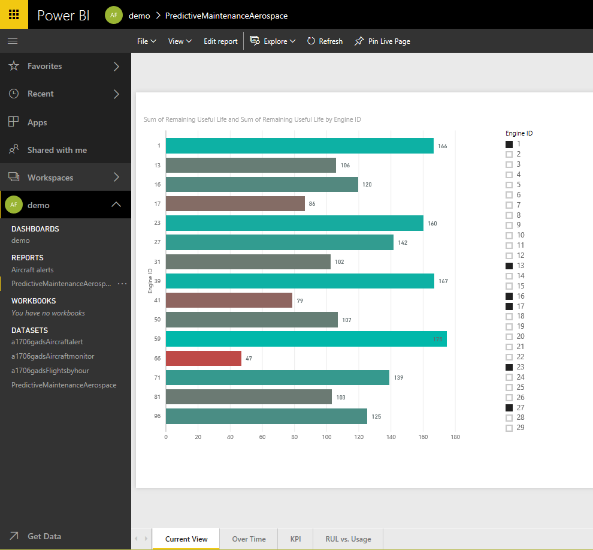
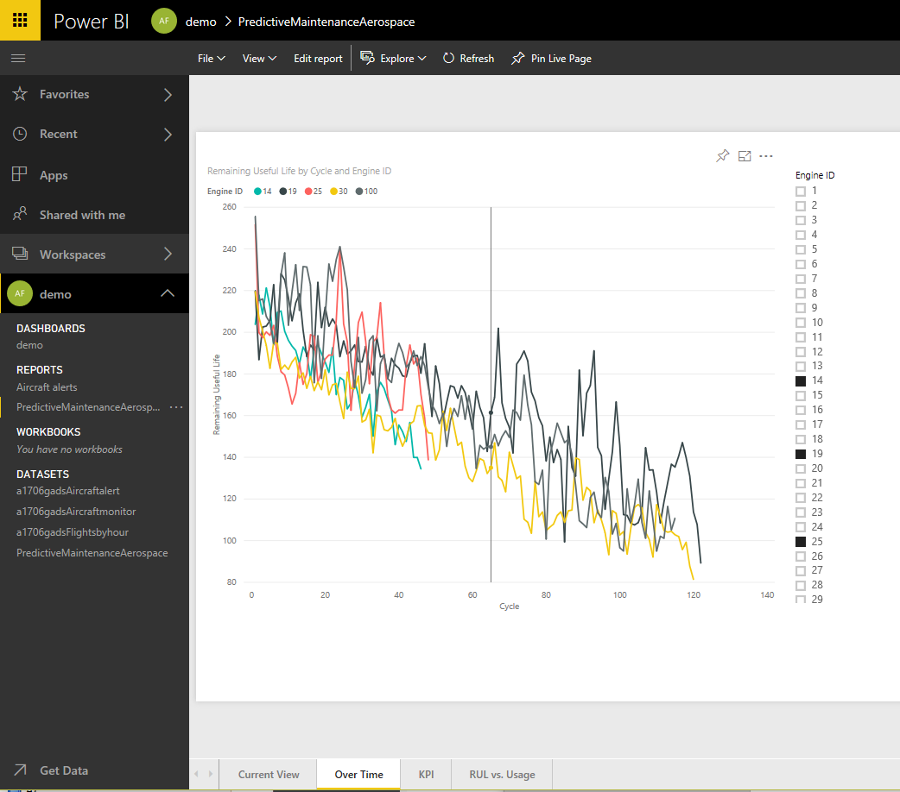
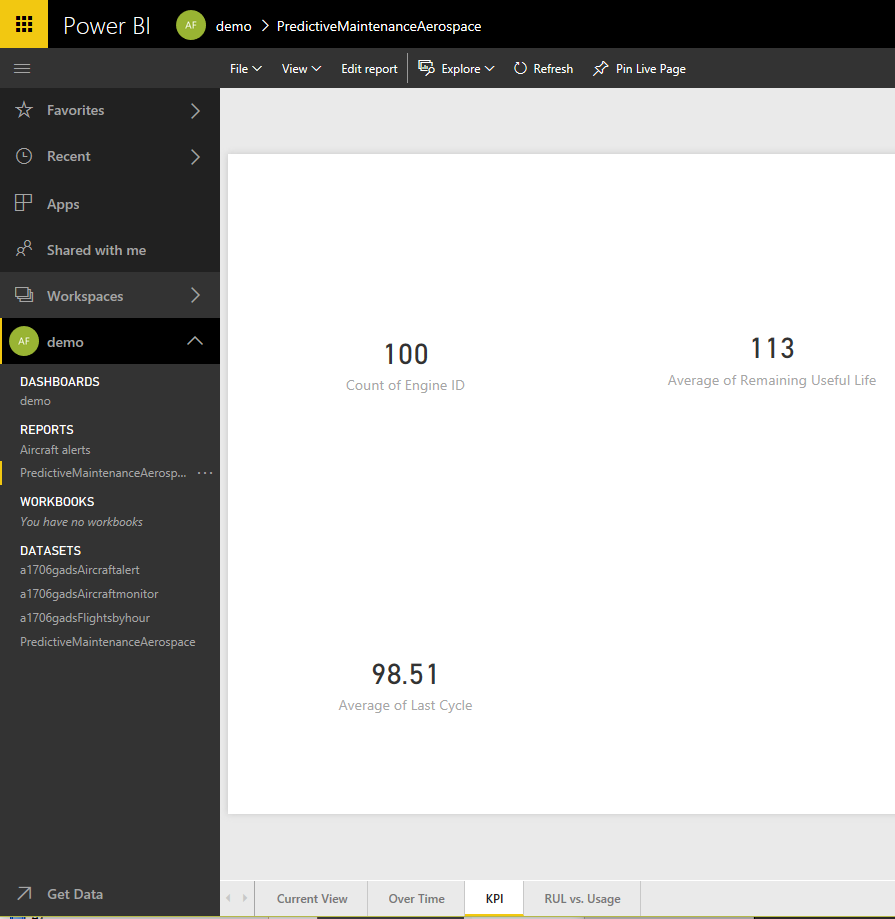
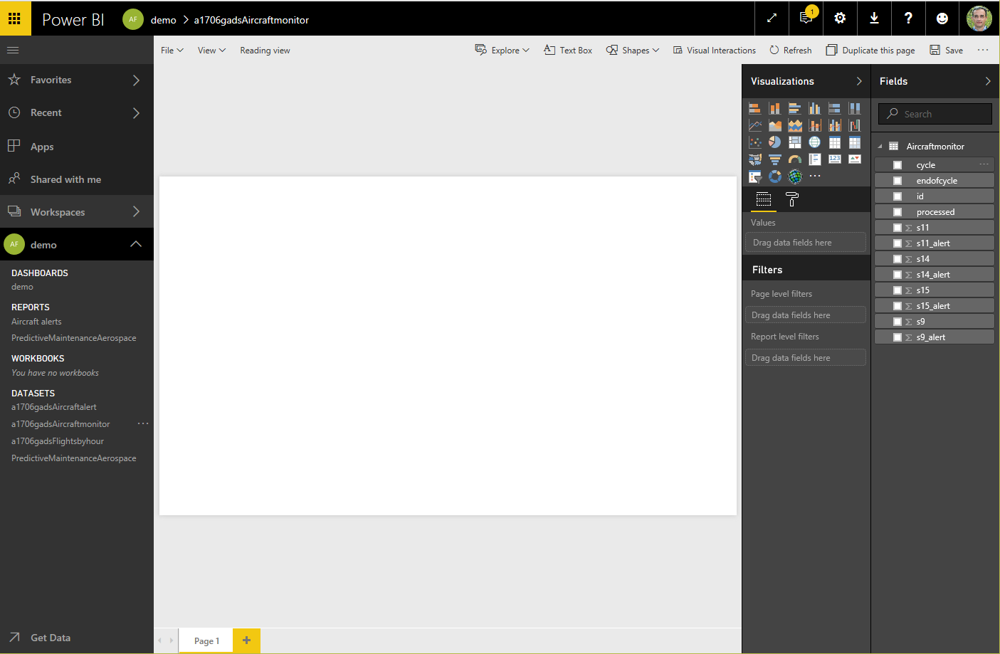

# Predictive Maintenance solution in Cortana Intelligence Suite

## Credits

These are examples of using <https://gallery.cortanaintelligence.com/Solution/Predictive-Maintenance-for-Aerospace-4>.

## screen shots

## More documentation on predictive maintenance

- [Cortana Intelligence Solution Template Playbook for predictive maintenance in aerospace and other businesses](https://docs.microsoft.com/en-us/azure/machine-learning/cortana-analytics-playbook-predictive-maintenance)
- [Cortana Intelligence Gallery - Azure ML templates](https://gallery.cortanaintelligence.com/Collection/Predictive-Maintenance-Template-3)
- [Predictive Maintenance Modelling Guide R Notebook](https://gallery.cortanaintelligence.com/Notebook/Predictive-Maintenance-Implementation-Guide-R-Notebook-2)