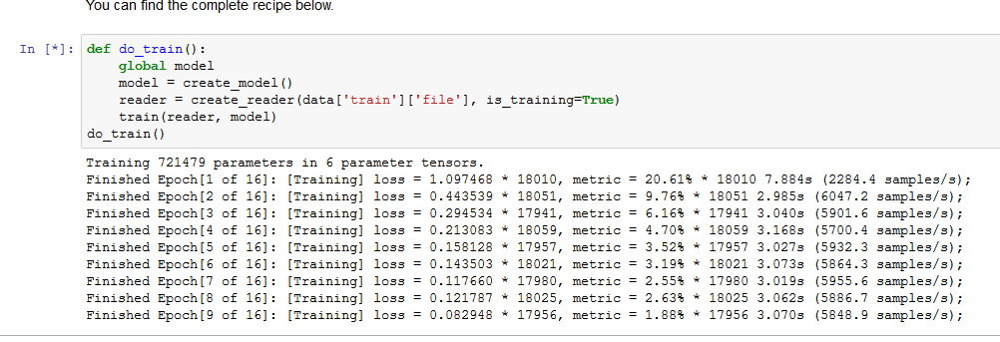
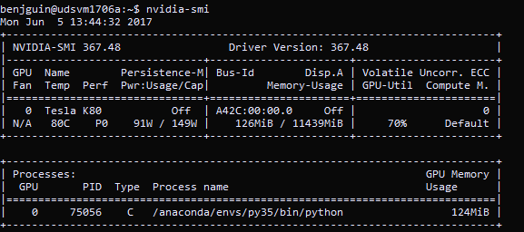

# CNTK

## credits and resources

- <https://docs.microsoft.com/en-us/cognitive-toolkit/>

## sample tests

An Ubuntu Data Science VM is created with HDD and NC6 VM size. 
A public IP CNAME is configured on the public IP and set to the $ct1706a_dsvm variable.

```
benjguin@X11511A:~$ ssh $ct1706a_dsvm
The authenticity of host 'udsvm1706a.northeurope.cloudapp.azure.com (52.169.29.80)' can't be established.
ECDSA key fingerprint is 67:16:cf:33:3f:9c:ec:4e:84:41:c0:41:03:b4:c9:5a.
Are you sure you want to continue connecting (yes/no)? yes
Warning: Permanently added 'udsvm1706a.northeurope.cloudapp.azure.com,52.169.29.80' (ECDSA) to the list of known hosts.
Welcome to Ubuntu 16.04.2 LTS (GNU/Linux 4.4.0-72-generic x86_64)

 * Documentation:  https://help.ubuntu.com
 * Management:     https://landscape.canonical.com
 * Support:        https://ubuntu.com/advantage

  Get cloud support with Ubuntu Advantage Cloud Guest:
    http://www.ubuntu.com/business/services/cloud

67 packages can be updated.
0 updates are security updates.


The programs included with the Ubuntu system are free software;
the exact distribution terms for each program are described in the
individual files in /usr/share/doc/*/copyright.

Ubuntu comes with ABSOLUTELY NO WARRANTY, to the extent permitted by
applicable law.

**********************************************************************
* Welcome to the Linux Data Science Virtual Machine on Azure!        *
*                                                                    *
* For more information on available tools and features,              *
* run `dsvm-more-info`.                                              *
**********************************************************************

To run a command as administrator (user "root"), use "sudo <command>".
See "man sudo_root" for details.
```

```
ssh -D 127.0.0.1:8034 $ct1706a_dsvm
```

```
benjguin@udsvm1706a:~$ nvidia-smi
Mon Jun  5 13:28:56 2017
+-----------------------------------------------------------------------------+
| NVIDIA-SMI 367.48                 Driver Version: 367.48                    |
|-------------------------------+----------------------+----------------------+
| GPU  Name        Persistence-M| Bus-Id        Disp.A | Volatile Uncorr. ECC |
| Fan  Temp  Perf  Pwr:Usage/Cap|         Memory-Usage | GPU-Util  Compute M. |
|===============================+======================+======================|
|   0  Tesla K80           Off  | A42C:00:00.0     Off |                    0 |
| N/A   66C    P8    30W / 149W |      0MiB / 11439MiB |      0%      Default |
+-------------------------------+----------------------+----------------------+

+-----------------------------------------------------------------------------+
| Processes:                                                       GPU Memory |
|  GPU       PID  Type  Process name                               Usage      |
|=============================================================================|
|  No running processes found                                                 |
+-----------------------------------------------------------------------------+
benjguin@udsvm1706a:~$ nvidia-smi -L
GPU 0: Tesla K80 (UUID: GPU-c9f34655-261a-9421-cf12-3c2d194dfcb9)
```

Documentation for this utility can be found here: <http://developer.download.nvidia.com/compute/DCGM/docs/nvidia-smi-367.38.pdf>

NB: use `watch nvidia-smi` to monitor the GPU usage instead of having a one shot view of it.

JupyterHub

define a password for current user (if you used an ssh key)

```bash
sudo passwd benjguin
```

connect to <https://0.0.0.0:8000> (https is important)

run the `CNTK_202_Language_Understanding` notebook in the CNTK folder





Sample output once everything has run: [CNTK_202_Language_Understanding.md](CNTK_202_Language_Understanding.md)

Other outputs are saved in this folder.
