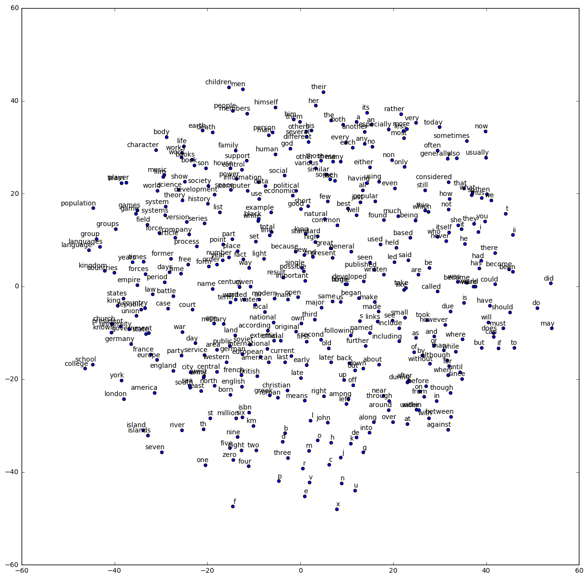

Deep Learning
=============

Assignment 5
------------

The goal of this assignment is to train a Word2Vec skip-gram model over [Text8](http://mattmahoney.net/dc/textdata) data.


```python
# These are all the modules we'll be using later. Make sure you can import them
# before proceeding further.
%matplotlib inline
from __future__ import print_function
import collections
import math
import numpy as np
import os
import random
import tensorflow as tf
import zipfile
from matplotlib import pylab
from six.moves import range
from six.moves.urllib.request import urlretrieve
from sklearn.manifold import TSNE
```

    /anaconda/envs/py35/lib/python3.5/site-packages/matplotlib/font_manager.py:273: UserWarning: Matplotlib is building the font cache using fc-list. This may take a moment.
      warnings.warn('Matplotlib is building the font cache using fc-list. This may take a moment.')
    /anaconda/envs/py35/lib/python3.5/site-packages/matplotlib/font_manager.py:273: UserWarning: Matplotlib is building the font cache using fc-list. This may take a moment.
      warnings.warn('Matplotlib is building the font cache using fc-list. This may take a moment.')


Download the data from the source website if necessary.


```python
url = 'http://mattmahoney.net/dc/'

def maybe_download(filename, expected_bytes):
  """Download a file if not present, and make sure it's the right size."""
  if not os.path.exists(filename):
    filename, _ = urlretrieve(url + filename, filename)
  statinfo = os.stat(filename)
  if statinfo.st_size == expected_bytes:
    print('Found and verified %s' % filename)
  else:
    print(statinfo.st_size)
    raise Exception(
      'Failed to verify ' + filename + '. Can you get to it with a browser?')
  return filename

filename = maybe_download('text8.zip', 31344016)
```

    Found and verified text8.zip


Read the data into a string.


```python
def read_data(filename):
  """Extract the first file enclosed in a zip file as a list of words"""
  with zipfile.ZipFile(filename) as f:
    data = tf.compat.as_str(f.read(f.namelist()[0])).split()
  return data
  
words = read_data(filename)
print('Data size %d' % len(words))
```

    Data size 17005207


Build the dictionary and replace rare words with UNK token.


```python
vocabulary_size = 50000

def build_dataset(words):
  count = [['UNK', -1]]
  count.extend(collections.Counter(words).most_common(vocabulary_size - 1))
  dictionary = dict()
  for word, _ in count:
    dictionary[word] = len(dictionary)
  data = list()
  unk_count = 0
  for word in words:
    if word in dictionary:
      index = dictionary[word]
    else:
      index = 0  # dictionary['UNK']
      unk_count = unk_count + 1
    data.append(index)
  count[0][1] = unk_count
  reverse_dictionary = dict(zip(dictionary.values(), dictionary.keys())) 
  return data, count, dictionary, reverse_dictionary

data, count, dictionary, reverse_dictionary = build_dataset(words)
print('Most common words (+UNK)', count[:5])
print('Sample data', data[:10])
del words  # Hint to reduce memory.
```

    Most common words (+UNK) [['UNK', 418391], ('the', 1061396), ('of', 593677), ('and', 416629), ('one', 411764)]
    Sample data [5237, 3084, 12, 6, 195, 2, 3136, 46, 59, 156]


Function to generate a training batch for the skip-gram model.


```python
data_index = 0

def generate_batch(batch_size, num_skips, skip_window):
  global data_index
  assert batch_size % num_skips == 0
  assert num_skips <= 2 * skip_window
  batch = np.ndarray(shape=(batch_size), dtype=np.int32)
  labels = np.ndarray(shape=(batch_size, 1), dtype=np.int32)
  span = 2 * skip_window + 1 # [ skip_window target skip_window ]
  buffer = collections.deque(maxlen=span)
  for _ in range(span):
    buffer.append(data[data_index])
    data_index = (data_index + 1) % len(data)
  for i in range(batch_size // num_skips):
    target = skip_window  # target label at the center of the buffer
    targets_to_avoid = [ skip_window ]
    for j in range(num_skips):
      while target in targets_to_avoid:
        target = random.randint(0, span - 1)
      targets_to_avoid.append(target)
      batch[i * num_skips + j] = buffer[skip_window]
      labels[i * num_skips + j, 0] = buffer[target]
    buffer.append(data[data_index])
    data_index = (data_index + 1) % len(data)
  return batch, labels

print('data:', [reverse_dictionary[di] for di in data[:8]])

for num_skips, skip_window in [(2, 1), (4, 2)]:
    data_index = 0
    batch, labels = generate_batch(batch_size=8, num_skips=num_skips, skip_window=skip_window)
    print('\nwith num_skips = %d and skip_window = %d:' % (num_skips, skip_window))
    print('    batch:', [reverse_dictionary[bi] for bi in batch])
    print('    labels:', [reverse_dictionary[li] for li in labels.reshape(8)])
```

    data: ['anarchism', 'originated', 'as', 'a', 'term', 'of', 'abuse', 'first']
    
    with num_skips = 2 and skip_window = 1:
        batch: ['originated', 'originated', 'as', 'as', 'a', 'a', 'term', 'term']
        labels: ['anarchism', 'as', 'a', 'originated', 'as', 'term', 'of', 'a']
    
    with num_skips = 4 and skip_window = 2:
        batch: ['as', 'as', 'as', 'as', 'a', 'a', 'a', 'a']
        labels: ['anarchism', 'term', 'a', 'originated', 'term', 'originated', 'of', 'as']


Train a skip-gram model.


```python
batch_size = 128
embedding_size = 128 # Dimension of the embedding vector.
skip_window = 1 # How many words to consider left and right.
num_skips = 2 # How many times to reuse an input to generate a label.
# We pick a random validation set to sample nearest neighbors. here we limit the
# validation samples to the words that have a low numeric ID, which by
# construction are also the most frequent. 
valid_size = 16 # Random set of words to evaluate similarity on.
valid_window = 100 # Only pick dev samples in the head of the distribution.
valid_examples = np.array(random.sample(range(valid_window), valid_size))
num_sampled = 64 # Number of negative examples to sample.

graph = tf.Graph()

with graph.as_default(), tf.device('/cpu:0'):

  # Input data.
  train_dataset = tf.placeholder(tf.int32, shape=[batch_size])
  train_labels = tf.placeholder(tf.int32, shape=[batch_size, 1])
  valid_dataset = tf.constant(valid_examples, dtype=tf.int32)
  
  # Variables.
  embeddings = tf.Variable(
    tf.random_uniform([vocabulary_size, embedding_size], -1.0, 1.0))
  softmax_weights = tf.Variable(
    tf.truncated_normal([vocabulary_size, embedding_size],
                         stddev=1.0 / math.sqrt(embedding_size)))
  softmax_biases = tf.Variable(tf.zeros([vocabulary_size]))
  
  # Model.
  # Look up embeddings for inputs.
  embed = tf.nn.embedding_lookup(embeddings, train_dataset)
  # Compute the softmax loss, using a sample of the negative labels each time.
  loss = tf.reduce_mean(
    tf.nn.sampled_softmax_loss(weights=softmax_weights, biases=softmax_biases, inputs=embed,
                               labels=train_labels, num_sampled=num_sampled, num_classes=vocabulary_size))

  # Optimizer.
  # Note: The optimizer will optimize the softmax_weights AND the embeddings.
  # This is because the embeddings are defined as a variable quantity and the
  # optimizer's `minimize` method will by default modify all variable quantities 
  # that contribute to the tensor it is passed.
  # See docs on `tf.train.Optimizer.minimize()` for more details.
  optimizer = tf.train.AdagradOptimizer(1.0).minimize(loss)
  
  # Compute the similarity between minibatch examples and all embeddings.
  # We use the cosine distance:
  norm = tf.sqrt(tf.reduce_sum(tf.square(embeddings), 1, keep_dims=True))
  normalized_embeddings = embeddings / norm
  valid_embeddings = tf.nn.embedding_lookup(
    normalized_embeddings, valid_dataset)
  similarity = tf.matmul(valid_embeddings, tf.transpose(normalized_embeddings))
```


```python
num_steps = 100001

with tf.Session(graph=graph) as session:
  tf.global_variables_initializer().run()
  print('Initialized')
  average_loss = 0
  for step in range(num_steps):
    batch_data, batch_labels = generate_batch(
      batch_size, num_skips, skip_window)
    feed_dict = {train_dataset : batch_data, train_labels : batch_labels}
    _, l = session.run([optimizer, loss], feed_dict=feed_dict)
    average_loss += l
    if step % 2000 == 0:
      if step > 0:
        average_loss = average_loss / 2000
      # The average loss is an estimate of the loss over the last 2000 batches.
      print('Average loss at step %d: %f' % (step, average_loss))
      average_loss = 0
    # note that this is expensive (~20% slowdown if computed every 500 steps)
    if step % 10000 == 0:
      sim = similarity.eval()
      for i in range(valid_size):
        valid_word = reverse_dictionary[valid_examples[i]]
        top_k = 8 # number of nearest neighbors
        nearest = (-sim[i, :]).argsort()[1:top_k+1]
        log = 'Nearest to %s:' % valid_word
        for k in range(top_k):
          close_word = reverse_dictionary[nearest[k]]
          log = '%s %s,' % (log, close_word)
        print(log)
  final_embeddings = normalized_embeddings.eval()
```

    Initialized
    Average loss at step 0: 7.987088
    Nearest to so: flirt, catholic, macrobiotic, cottage, freefall, racketeering, hooking, segregated,
    Nearest to will: giacometti, selznick, sorbian, sophie, victoriae, wally, amphetamines, tributaries,
    Nearest to on: strap, twiggy, complains, cesium, cayuga, kazakhs, moreno, midwives,
    Nearest to often: butterfield, basement, noirs, rationing, counterbalance, foobar, abilities, seljuk,
    Nearest to five: pusc, monstrous, unikom, hominids, exacerbating, chants, microstates, dared,
    Nearest to about: dirks, renault, arroyo, sdlp, denslow, rearmament, wider, mansions,
    Nearest to have: insightful, flute, autonomic, discourses, batcave, macon, tianjin, halen,
    Nearest to not: ellen, hedwig, thunderbolt, mitford, backyard, sitting, lifeforms, reagents,
    Nearest to two: crimea, patricio, thorny, superintendent, irreverent, accentual, burundi, quine,
    Nearest to however: xenophobic, thoth, terre, kaunas, foyle, admirer, reproducing, coastlines,
    Nearest to its: nephews, hereby, handloading, clan, monsieur, adic, ecologist, federico,
    Nearest to that: remainders, cox, lichen, accepted, southerners, elton, commuting, chari,
    Nearest to first: rulings, eternally, are, storehouse, thinkpad, softball, cruising, numbered,
    Nearest to but: jis, course, shehhi, mack, instructive, vacant, hausdorff, entice,
    Nearest to between: upheavals, persecuting, merritt, huck, sliced, hypermedia, currencies, coinage,
    Nearest to zero: constellation, schleswig, bytecode, turnaround, queene, justice, howling, magnetron,
    Average loss at step 2000: 4.370007
    Average loss at step 4000: 3.868300
    Average loss at step 6000: 3.789742
    Average loss at step 8000: 3.688904
    Average loss at step 10000: 3.618521
    Nearest to so: macrobiotic, hath, guarneri, flirt, sometimes, catholic, sexton, serious,
    Nearest to will: would, could, consequentialism, selznick, sophie, giacometti, jive, tributaries,
    Nearest to on: in, at, by, strap, posse, effluents, from, hilaire,
    Nearest to often: also, commonly, accordions, butterfield, tuna, caddy, not, lesh,
    Nearest to five: six, eight, seven, three, four, nine, two, zero,
    Nearest to about: dirks, wider, find, henceforth, implanted, savvy, intercession, vance,
    Nearest to have: be, had, insightful, has, are, were, macon, boutros,
    Nearest to not: they, it, also, xena, we, levers, planning, marietta,
    Nearest to two: three, four, five, six, one, eight, seven, nine,
    Nearest to however: kaunas, navy, cayenne, xenophobic, earned, urgency, destabilization, defensible,
    Nearest to its: their, the, kitchen, his, albedo, incidents, advancement, glock,
    Nearest to that: which, usually, it, nasl, this, differently, he, who,
    Nearest to first: during, cruising, rulings, before, eternally, licit, tread, communicating,
    Nearest to but: materiel, drew, apollo, blasphemous, colombo, exercises, tracing, course,
    Nearest to between: sliced, persecuting, huck, with, coinage, lombardi, lungs, televised,
    Nearest to zero: seven, nine, six, five, eight, four, three, two,
    Average loss at step 12000: 3.608039
    Average loss at step 14000: 3.572963
    Average loss at step 16000: 3.405997
    Average loss at step 18000: 3.462468
    Average loss at step 20000: 3.545085
    Nearest to so: sometimes, hath, opulent, logged, sexton, dental, refrigeration, guarneri,
    Nearest to will: would, could, can, may, cannot, selznick, should, consequentialism,
    Nearest to on: in, at, strap, frankish, behind, fulgencio, complains, through,
    Nearest to often: commonly, also, that, not, who, tuna, which, there,
    Nearest to five: four, eight, six, three, two, seven, zero, nine,
    Nearest to about: wider, dirks, implanted, over, astute, henceforth, vance, mathers,
    Nearest to have: had, has, be, were, are, insightful, palatine, boutros,
    Nearest to not: it, often, generally, they, also, to, somewhat, levers,
    Nearest to two: five, three, four, six, seven, one, eight, nine,
    Nearest to however: but, navy, that, although, earned, kaunas, attrition, corsican,
    Nearest to its: their, his, the, kitchen, her, bowles, peshitta, incidents,
    Nearest to that: which, often, however, but, this, what, permeated, crafted,
    Nearest to first: last, eternally, sermon, during, posited, second, preoccupation, gresham,
    Nearest to but: although, while, and, enrichment, however, which, that, colombo,
    Nearest to between: with, sliced, from, televised, coinage, in, namespaces, minogue,
    Nearest to zero: five, six, seven, nine, four, eight, three, two,
    Average loss at step 22000: 3.506841
    Average loss at step 24000: 3.487811
    Average loss at step 26000: 3.483701
    Average loss at step 28000: 3.483318
    Average loss at step 30000: 3.507954
    Nearest to so: sometimes, hath, boating, dental, logged, tallis, baines, sexton,
    Nearest to will: would, can, could, may, cannot, should, must, to,
    Nearest to on: in, from, at, through, midwives, homogeneous, upon, effluents,
    Nearest to often: commonly, also, sometimes, not, generally, tuna, usually, now,
    Nearest to five: eight, four, seven, six, three, nine, zero, two,
    Nearest to about: wider, americas, cthulhu, lost, moussa, mathers, vance, implanted,
    Nearest to have: had, has, are, were, be, insightful, say, include,
    Nearest to not: they, it, generally, usually, often, never, still, reeds,
    Nearest to two: four, three, one, five, seven, six, eight, zero,
    Nearest to however: but, although, that, navy, when, earned, suffocation, though,
    Nearest to its: their, the, his, her, bowles, kitchen, traitor, a,
    Nearest to that: which, what, however, but, this, barracks, southerners, crafted,
    Nearest to first: last, second, next, tread, rulings, gresham, preoccupation, soviets,
    Nearest to but: however, while, which, although, and, it, that, he,
    Nearest to between: with, from, in, sliced, pxe, hallucinogenic, coinage, televised,
    Nearest to zero: five, eight, seven, four, six, nine, three, two,
    Average loss at step 32000: 3.504852
    Average loss at step 34000: 3.488339
    Average loss at step 36000: 3.459731
    Average loss at step 38000: 3.301764
    Average loss at step 40000: 3.430921
    Nearest to so: sometimes, logged, tallis, boating, hath, baines, lewes, intern,
    Nearest to will: would, can, could, may, must, should, cannot, might,
    Nearest to on: at, upon, through, during, post, posse, from, renarrative,
    Nearest to often: commonly, also, sometimes, usually, who, which, generally, widely,
    Nearest to five: six, seven, four, eight, three, zero, nine, two,
    Nearest to about: wider, americas, over, lost, henceforth, cthulhu, moussa, dirks,
    Nearest to have: had, has, were, are, be, insightful, say, never,
    Nearest to not: usually, they, never, often, generally, only, it, still,
    Nearest to two: three, four, five, six, seven, one, eight, zero,
    Nearest to however: but, although, that, though, while, attrition, swede, they,
    Nearest to its: their, his, her, the, traitor, bowles, debates, your,
    Nearest to that: which, what, this, however, rationalisation, also, sheppard, it,
    Nearest to first: second, last, next, fourth, andre, poulsen, flickering, suppliers,
    Nearest to but: however, although, while, and, it, though, nor, which,
    Nearest to between: with, from, in, sliced, through, desecration, pxe, hallucinogenic,
    Nearest to zero: five, seven, eight, nine, six, four, three, two,
    Average loss at step 42000: 3.439172
    Average loss at step 44000: 3.455414
    Average loss at step 46000: 3.448976
    Average loss at step 48000: 3.358411
    Average loss at step 50000: 3.385976
    Nearest to so: then, lewes, if, baines, boating, belarus, eventually, unspecific,
    Nearest to will: would, could, can, may, must, cannot, should, might,
    Nearest to on: upon, in, from, frankish, through, hannibal, at, strap,
    Nearest to often: commonly, usually, generally, sometimes, also, widely, frequently, which,
    Nearest to five: four, six, seven, eight, zero, nine, three, two,
    Nearest to about: over, moussa, wider, americas, lost, mathers, cthulhu, implanted,
    Nearest to have: had, has, were, are, be, insightful, include, having,
    Nearest to not: usually, generally, never, still, now, underage, often, actually,
    Nearest to two: one, three, four, six, five, eight, seven, zero,
    Nearest to however: but, although, that, when, though, bbci, while, attrition,
    Nearest to its: their, his, the, her, bowles, your, relented, traitor,
    Nearest to that: which, however, what, boutiques, this, barracks, desk, often,
    Nearest to first: second, last, next, same, soviets, deconstruction, sun, vampires,
    Nearest to but: however, although, while, and, when, though, he, during,
    Nearest to between: with, through, among, ceos, sliced, from, in, minogue,
    Nearest to zero: five, four, six, eight, seven, nine, three, two,
    Average loss at step 52000: 3.439916
    Average loss at step 54000: 3.426049
    Average loss at step 56000: 3.437762
    Average loss at step 58000: 3.399798
    Average loss at step 60000: 3.392673
    Nearest to so: then, if, boating, lewes, never, eventually, unspecific, too,
    Nearest to will: would, could, can, may, must, should, cannot, might,
    Nearest to on: upon, in, through, frankish, attainder, strap, under, highlander,
    Nearest to often: commonly, sometimes, usually, generally, also, now, widely, frequently,
    Nearest to five: six, four, three, eight, seven, zero, nine, two,
    Nearest to about: over, mathers, moussa, what, implanted, americas, dirks, wider,
    Nearest to have: has, had, are, were, be, having, include, represent,
    Nearest to not: usually, never, still, generally, actually, now, underage, they,
    Nearest to two: three, four, five, one, six, seven, eight, zero,
    Nearest to however: but, although, that, which, though, attrition, suffocation, when,
    Nearest to its: their, his, her, the, relented, our, kosar, ducati,
    Nearest to that: which, what, however, this, barracks, it, allegation, scan,
    Nearest to first: last, second, next, rulings, same, only, third, final,
    Nearest to but: however, although, and, while, absolutive, see, than, bowels,
    Nearest to between: with, among, through, in, sliced, ceos, from, towards,
    Nearest to zero: five, four, seven, eight, six, three, nine, two,
    Average loss at step 62000: 3.240003
    Average loss at step 64000: 3.257906
    Average loss at step 66000: 3.405233
    Average loss at step 68000: 3.394216
    Average loss at step 70000: 3.358603
    Nearest to so: if, sometimes, too, then, boating, eventually, conan, lewes,
    Nearest to will: would, could, can, may, must, should, might, cannot,
    Nearest to on: upon, through, in, ise, under, hijacker, wormhole, effluents,
    Nearest to often: commonly, sometimes, usually, generally, now, also, frequently, typically,
    Nearest to five: six, four, three, seven, eight, zero, nine, two,
    Nearest to about: over, solute, tenth, dirks, wider, on, relinquishing, cthulhu,
    Nearest to have: had, has, were, are, include, having, be, provide,
    Nearest to not: usually, never, generally, still, now, often, always, actually,
    Nearest to two: four, three, six, one, five, seven, eight, zero,
    Nearest to however: but, although, that, though, while, which, when, where,
    Nearest to its: their, his, her, the, your, bowles, platte, whose,
    Nearest to that: which, however, what, barracks, this, but, often, bugtraq,
    Nearest to first: second, last, next, third, same, final, fourth, rulings,
    Nearest to but: however, although, while, and, which, absolutive, though, than,
    Nearest to between: with, among, from, in, through, around, hallucinogenic, sliced,
    Nearest to zero: five, six, eight, four, seven, nine, three, acres,
    Average loss at step 72000: 3.380799
    Average loss at step 74000: 3.349808
    Average loss at step 76000: 3.318657
    Average loss at step 78000: 3.352405
    Average loss at step 80000: 3.374331
    Nearest to so: sometimes, then, boating, eventually, if, drip, too, simply,
    Nearest to will: would, could, can, may, must, should, cannot, might,
    Nearest to on: upon, in, through, promiscuity, frankish, rosalyn, strap, at,
    Nearest to often: sometimes, usually, commonly, generally, typically, still, also, frequently,
    Nearest to five: six, four, seven, eight, three, nine, zero, two,
    Nearest to about: wider, mathers, mapping, valved, solute, henceforth, nr, chung,
    Nearest to have: had, has, are, were, be, include, having, represent,
    Nearest to not: still, usually, generally, never, now, actually, often, it,
    Nearest to two: three, four, six, five, one, seven, eight, zero,
    Nearest to however: but, although, while, though, that, where, which, when,
    Nearest to its: their, his, her, the, your, platte, our, traitor,
    Nearest to that: which, however, where, boutiques, this, entrenchment, what, permeated,
    Nearest to first: last, second, next, third, same, fourth, final, sun,
    Nearest to but: however, although, while, and, though, see, until, absolutive,
    Nearest to between: among, with, within, over, in, including, around, pxe,
    Nearest to zero: seven, five, six, four, eight, nine, three, two,
    Average loss at step 82000: 3.410935
    Average loss at step 84000: 3.414991
    Average loss at step 86000: 3.390074
    Average loss at step 88000: 3.352816
    Average loss at step 90000: 3.365014
    Nearest to so: if, then, how, confucius, drip, too, fashion, eventually,
    Nearest to will: would, could, can, must, may, should, might, cannot,
    Nearest to on: upon, under, uninhabited, at, through, hijacker, from, within,
    Nearest to often: sometimes, commonly, usually, generally, typically, still, frequently, also,
    Nearest to five: seven, four, six, eight, three, nine, two, zero,
    Nearest to about: regarding, mathers, wider, mapping, rhein, valved, solute, metaphors,
    Nearest to have: had, has, be, are, were, having, include, provide,
    Nearest to not: still, now, generally, actually, never, usually, only, denatured,
    Nearest to two: three, four, five, six, one, eight, seven, zero,
    Nearest to however: but, although, that, though, while, fact, disperse, where,
    Nearest to its: their, his, her, the, bowles, our, traitor, your,
    Nearest to that: which, however, what, heiner, boutiques, but, chronica, also,
    Nearest to first: last, second, next, fourth, third, latter, same, final,
    Nearest to but: however, although, while, and, though, which, until, it,
    Nearest to between: within, with, among, around, in, through, from, over,
    Nearest to zero: seven, five, six, eight, four, nine, three, two,
    Average loss at step 92000: 3.397678
    Average loss at step 94000: 3.259723
    Average loss at step 96000: 3.360018
    Average loss at step 98000: 3.243261
    Average loss at step 100000: 3.359217
    Nearest to so: then, thus, eventually, sometimes, too, if, drip, how,
    Nearest to will: would, could, can, must, may, should, might, cannot,
    Nearest to on: upon, in, at, through, under, effluents, within, attainder,
    Nearest to often: sometimes, usually, commonly, generally, typically, frequently, still, widely,
    Nearest to five: four, six, seven, eight, three, zero, nine, two,
    Nearest to about: answer, valved, rhein, scribes, wider, metaphors, solute, mapping,
    Nearest to have: had, has, having, are, were, be, include, represent,
    Nearest to not: still, never, now, actually, generally, usually, almost, also,
    Nearest to two: four, three, five, six, one, seven, eight, zero,
    Nearest to however: but, although, that, though, while, where, especially, and,
    Nearest to its: their, his, her, the, your, traitor, our, havens,
    Nearest to that: which, however, what, who, methylation, this, but, boutiques,
    Nearest to first: last, next, second, third, fourth, final, latter, suppliers,
    Nearest to but: however, although, and, while, though, where, backstreet, which,
    Nearest to between: with, within, among, through, in, over, around, armouries,
    Nearest to zero: five, seven, four, eight, six, nine, three, two,


```python
num_points = 400

tsne = TSNE(perplexity=30, n_components=2, init='pca', n_iter=5000)
two_d_embeddings = tsne.fit_transform(final_embeddings[1:num_points+1, :])
```


```python
def plot(embeddings, labels):
  assert embeddings.shape[0] >= len(labels), 'More labels than embeddings'
  pylab.figure(figsize=(15,15))  # in inches
  for i, label in enumerate(labels):
    x, y = embeddings[i,:]
    pylab.scatter(x, y)
    pylab.annotate(label, xy=(x, y), xytext=(5, 2), textcoords='offset points',
                   ha='right', va='bottom')
  pylab.show()

words = [reverse_dictionary[i] for i in range(1, num_points+1)]
plot(two_d_embeddings, words)
```





---

Problem
-------

An alternative to skip-gram is another Word2Vec model called [CBOW](http://arxiv.org/abs/1301.3781) (Continuous Bag of Words). In the CBOW model, instead of predicting a context word from a word vector, you predict a word from the sum of all the word vectors in its context. Implement and evaluate a CBOW model trained on the text8 dataset.

---
